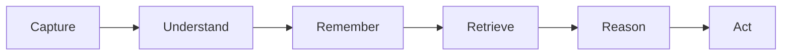

# Vision: local-first meeting intelligence

## Problem

Knowledge workers spend hours a day in Meet and Teams calls, then lose what was said: manual notes miss decisions, action items scatter across chat and memory, and "what did we agree?" costs a re-watch. Cloud meeting recorders make it worse for private work — the transcript of a confidential conversation leaves the user's control by default.

Companion removes that loss at the source: a browser extension captures captions from the meeting DOM, archives the raw transcript locally, and turns it into structured knowledge — summary, decisions, action items, risks, open questions — searchable and exportable, with nothing stored in a vendor cloud.

## Users

- **Primary:** a knowledge worker in Google Meet / Microsoft Teams calls who needs accurate notes without typing during the call — then searches, asks cross-meeting questions, and exports (Markdown/PDF/Obsidian) into a wider knowledge base.
- **Programmatic:** local MCP clients (Codex, Claude Code) reading the archive through read-only tools.
- **Not an MVP user:** teams in a shared workspace — Companion is personal, single-user, multi-device.

## Vision

One local-first personal knowledge system where meetings become durable, queryable knowledge:

- the extension captures knowledge at its source and stays a complete product on its own;
- meetings are native knowledge objects linked to decisions, actions, projects, notes, other meetings — not a flat transcript file;
- AI is a grounded local retrieval layer (SQLite/FTS5 + structured memory) citing verifiable transcript evidence, not an ungrounded sidebar;
- desktop and encrypted sync are additive surfaces built only when measured demand pays for them; cloud, where used, only relays encrypted state.

## Product principles

1. **Local-first, private by default** — capture, archive, search and export work offline; only what the user sends to the AI provider they chose leaves the machine.
2. **Preserve raw evidence** — raw transcript lines are immutable; cleanup and analysis create versions, never overwrites.
3. **Grounded answers only** — Ask cites evidence refs back to transcript lines; retrieval is SQLite + FTS5 + structured memory, no embeddings, no vector DB.
4. **One canonical model** — Markdown for human-authored notes, SQLite for structured meeting state; every index is derived and rebuildable.
5. **Surfaces stay independently useful** — extension alone is complete; desktop, sync and MCP are additive, never hard dependencies.
6. **Evolve, don't rewrite** — the existing TypeScript pipeline, provider abstraction, store and exporters are extended in place.

## Scope

| In (today) | Out (for now) |
|---|---|
| Meet/Teams capture, transcript archive, AI analysis, Ask v2 | Zoom live capture (file/audio import only) |
| Exports: Markdown, PDF, checklist, ICS, Obsidian-friendly probe | Team collaboration, shared workspaces |
| Read-only local MCP; optional E2EE self-host sync | Embeddings/vector DB, realtime push, hosted backend |

## Where to read next

- Product requirements: [01-product-requirements](01-product-requirements.md) · System and data architecture: [02-system-architecture](02-system-architecture.md)
- Product phases and demand gates: [06-roadmap](06-roadmap.md) · Architecture background: [COMPANION_UNIFIED_ARCHITECTURE](COMPANION_UNIFIED_ARCHITECTURE.md)
