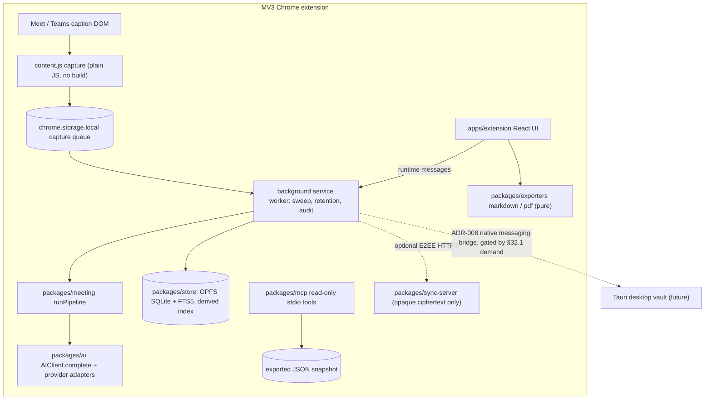
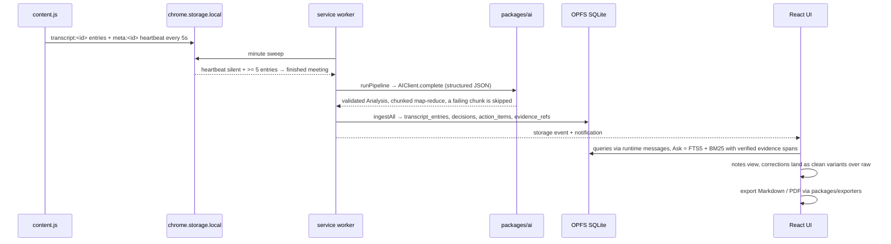

# System architecture

## Problem and requirements

Meet Companion turns live Google Meet / Microsoft Teams captions into durable AI meeting notes without a server in the capture path. Hard requirements: capture survives selector rot and page reloads; raw transcript lines are immutable evidence; analysis is validated structured JSON, not free text; the archive stays on-device and searchable offline; AI provider is user policy (API key, subscription sign-in, or local); export works without the app running. Single-user and local-first — the desktop vault and multi-device sync are ADR-gated futures (§32.1), not current scope.

## Proposed design



One repo, one build, no microservices. `content.js` is the only DOM reader; the service worker is the sole orchestrator and the only OPFS writer; React stays in `apps/extension/src`; every `packages/*` module is framework-free. Chrome storage is the capture archive and rollback copy; OPFS SQLite is a rebuildable queryable index (`ingestAll`), never a second truth. Desktop and sync v2 operations wait behind ADR-008/ADR-013 and the §32.1 demand gate.

## Core interfaces

Real names from `packages/store/src/schema.ts` (schema v5, migrations append-only):

```sql
meeting_rooms(id, platform, external_room_id)
meeting_sessions(id, room_id, title, platform, started_at, project_id, source)
transcript_entries(session_id, variant 'raw'|'clean', seq, entry_key, speaker, text)  -- raw immutable
transcript_fts(fts5 external-content index on transcript_entries)
decisions(topic, decision, superseded_by) · action_items(task, owner, status, external_ref)
open_questions(question, status, resolved_in) · risks(risk)
evidence_refs(entity_type, entity_id, transcript_entry_id)  -- every extraction traces to raw lines
memory_fts(kind, session_id, entity_id, text) · documents(session_id, type, content)
projects(id, name) · sync_outbox(session_id, op, sent_at) · kv(key, value)
```

All access goes through `CompanionStore` (`packages/store/src/store.ts`), owned by the service worker. AI is one strategy interface, `AIClient.complete(CompletionRequest)` plus `PROVIDER_PRESETS` (`packages/ai/src/client.ts`); OAuth stays protocol-only in `packages/ai/src/oauth.ts`.

## User-turn flow



## Failure, security, and performance

AI failure is bounded: transient errors retry with classification, output is validated before persist, a failed chunk is skipped rather than fatal, runs are rate-limited (6 / 10 min). The SQLite index is disposable — rebuildable from storage at any time; the Chrome capture copy is the rollback source. Raw transcripts are never overwritten: cleanup lands as `clean` variants and downstream AI reads the user-chosen version. Security: provider credentials AES-GCM at rest (same-profile key — casual-dump protection only); no blanket host permissions, integrations are per-origin `optional_host_permissions`; sync server sees only opaque ciphertext; MCP is read-only; content scripts hold no credentials or vault access. Performance: lexical FTS5/BM25 with conversation-window expansion instead of embeddings; bounded-parallel chunk analysis; PDF code-split and lazy-loaded; single-writer OPFS avoids SQLite contention.

## Alternatives and decision

Making OPFS SQLite canonical now would let UI mutations survive rebuilds, but it splits truth across two stores mid-migration; the audit (unified §2.6) keeps Chrome storage canonical and SQLite derived until the desktop vault imports under the Option B split (Markdown for human notes, SQLite for structured records — §11). Vector/embedding retrieval was rejected: the documented pain is query planning and evidence verification, not recall. Queues and microservices were rejected — one deployable `sync-server` on Node stdlib only. Decision: evolve the existing packages in place; desktop, native bridge, and v2 op-based sync proceed only after the ADR-008/013 and §32.1 gates pass.

## Open questions

Whether the §32.1 gate (G1 export adoption / G3 cross-meeting Ask) passes within six weeks and desktop Phase 1 starts; native-messaging installer friction after code signing (spike D9); SQLCipher versus OS full-disk encryption for the local database (§34); retention windows for tombstones, operation history, and v1 sync bundles (§34).
