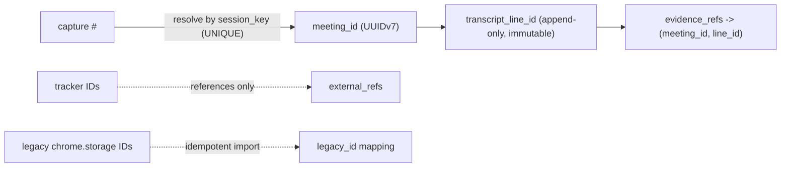

# Data and identity

Canonical state lives in two forms: Markdown files for human-authored documents and SQLite for meetings, transcripts, and structured entities. This page summarizes the storage schema shipped today and the identity rules every future table, sync operation, and vault file must follow (ADR-013).

## Canonical schema today (packages/store)

SQLite (WASM + OPFS in the extension; native in the coming desktop) applies versioned migrations from `MIGRATIONS` in `packages/store/src/schema.ts`. `PRAGMA user_version` records how many steps have run; shipped steps are never edited — fixes append a new one.

| Table(s) | Contents | Notes |
|---|---|---|
| `meeting_rooms`, `meeting_sessions` | rooms, sessions, project/calendar links, `source` (`capture`/`sync`/`share`) | `platform` is a free-form TEXT column derived from the meeting-id prefix, not from a URL |
| `transcript_entries`, `transcript_fts` | raw + AI-cleaned `variant` lines, `UNIQUE(session_id, variant, seq)`; FTS5 kept in sync by triggers | the raw variant is never overwritten, so a bad cleanup is always recoverable |
| `participants` | per-session speaker line counts | |
| `analyses`, `documents`, `chat_messages` | AI analysis JSON, generated documents, Ask/chat history | |
| `decisions`, `action_items`, `open_questions`, `risks`, `evidence_refs`, `memory_fts` | structured meeting memory plus provenance rows pointing back at transcript entry IDs | every extracted entity is traceable to its source lines |
| `projects`, `highlights`, `templates`, `kv`, `sync_outbox` | projects, saved lines, note templates, settings, sync outbox | outbox delivery is acknowledged per operation, not by timestamp |

## Identity model (ADR-013)

Identity is the only one-way door in the architecture: Tauri, parsers, and embeddings are replaceable; IDs baked into a user vault are not retroactively changeable. Conflict resolution, backlinks, provenance, and dual-path dedupe all key off identity, so a wrong model corrupts silently and permanently.

| # | Binding product constraint |
|---|---|
| 1 | IDs survive renames — display names are always derived, never the key |
| 2 | `operation_id` dedupe closes the bridge + cloud double-delivery case |
| 3 | Line-level provenance survives cleanup — evidence resolves to raw line IDs, never line numbers |
| 4 | Tracker IDs (Jira/Linear/Notion) are references, never primary keys |
| 5 | Legacy `chrome.storage` import is idempotent — re-import produces zero duplicates |
| 6 | Capture-level session identity stays `<room>#<start-ms>`; recurring rooms never merge |

**Decision:** all canonical entity IDs (`meeting_id`, `document_id`, `transcript_line_id`, `decision_id`, `action_id`, `vault_id`, `device_id`, …) are **UUIDv7 (RFC 9562)**, generated locally at creation. Time-ordered IDs keep SQLite B-tree inserts append-only during bulk transcript capture/import and give chronological ordering for free; IDs are opaque strings outside the storage layer. The extension keeps `<room>#<start-ms>` (fallback `tms-<epoch-ms>`) as its capture identity; the canonical meeting stores it as `session_key` (UNIQUE) and resolves by it first, so re-capture and re-import are idempotent without touching extension code. Tracker references live only in `external_refs(entity_id, system, external_key, url)`; legacy entities map through a `legacy_id` table that preserves the original ID as provenance. **Fallback:** if a platform cannot produce UUIDv7, the only sanctioned deviation is UUIDv4 plus an explicit `created_at_ms` column. Platform validation passed 2026-08-27 (Rust `uuid` crate, Node `uuid@14`, buildless MV3 `crypto.getRandomValues()`).

## Sync idempotency (operation_id)

Every local mutation creates one operation before network delivery, with the `operation_id` generated once at capture time and immutable. The server enforces a unique constraint on `(vault_id, operation_id)` and assigns a monotonic `server_cursor` when it first accepts an ID: retries and the bridge + cloud double-delivery case (ADR-008) apply exactly once, and duplicate delivery returns the original cursor instead of creating a second record. The same immutable operation ID rides the native-messaging bridge path and the optional E2EE cloud path, so desktop dedupes regardless of arrival order. Client clocks never determine server ordering; acknowledgment is by exact operation ID, never "everything before time T", and outbox insertion shares the canonical SQLite transaction.

## Integrity scanner (planned — Phase 1 DoD)

Per decision D6, a dual-canonical integrity scanner with ID-schema checks gates the desktop vault: enforce the UUIDv7 pattern per entity type, frontmatter `document_id` presence and uniqueness, `session_key` uniqueness on meetings, and `external_refs` as the only tracker linkage. A violation is treated as data corruption, not a recoverable bug. The scanner ships with the desktop vault (Phase 1); it is not part of the current extension-only codebase. Per ADR-0015 (2026-08-28) the two identity checks are pinned as `SC-SESSION-KEY` (every canonical meeting has a UNIQUE non-null `session_key` matching `^([A-Za-z0-9._-]{1,64}#\d{13}|tms-\d{13})$`) and `SC-EXT-REFS` (`external_refs` exists and is the only tracker linkage); both are Phase 1 DoD items backed by vault migrations M+1/M+2. The sync-server is explicitly out of scope — it stores only opaque sealed bundles (ADR-005/ADR-007) and never grows canonical columns. Core capture tables keep `<room>#<start-ms>`; the UUIDv7 `meeting_id` is assigned at the import/canonical boundary only.

## Security boundaries

- The extension never reads the vault: content script and service worker hold no vault key (§36.2, enforced by the §7 component responsibility boundaries).
- Sync payloads are E2EE; the server stores opaque ciphertext plus routing metadata only — never plaintext knowledge, AI, or search (§16, §36.1).
- Server-visible `operation_id`/`object_id` stay opaque; whether transport aliases them per vault is deferred to the Phase 3 crypto review (two-way door — vault-local IDs are unaffected).
- Related ADRs: ADR-008 (extension/desktop communication), ADR-013 (identity model, this page), §14.3 (operation model).
