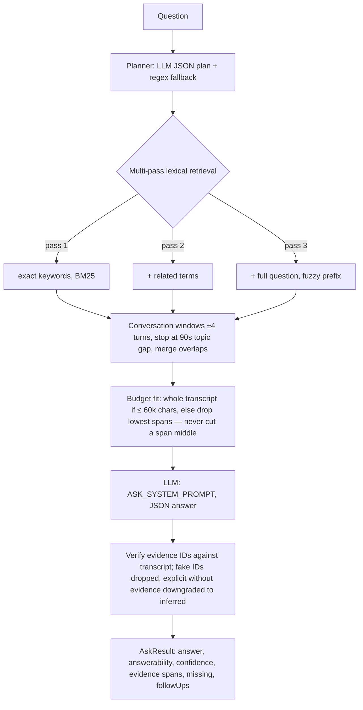

# AI Ask Engine

How Companion answers questions about a meeting (single-meeting Ask) or across all stored meetings (Global Ask), without embeddings or a vector database.

Authoritative sources: [COMPANION_UNIFIED_ARCHITECTURE.md](COMPANION_UNIFIED_ARCHITECTURE.md) §19–20, §32.1, §37 D1; canonical v2 spec: [ask-v2-spec.md](ask-v2-spec.md) (not duplicated here — referenced).

## Problem

Meeting questions carry strong lexical signal (names, apps, decisions, dates), so lexical retrieval plus conversation windows answers them; the failure mode was the model answering "not mentioned" when the transcript held a partial or implicit answer. Ask v1 already fixes the known causes (head-tail truncation, unverified citations, refusal-prone prompt). Ask v2 closes the remaining evaluation and routing gaps.

## Current architecture (v1)

Two modes, one shared design:

| Mode | Entry point | Package | Scope |
|---|---|---|---|
| Single-meeting Ask | `askMeeting()` / `askTranscript()` | `@meetcc/ai` (`ask.ts`, `retrieval.ts`) | one transcript + analysis |
| Global Ask | `askMeetings()` | `@meetcc/meeting` (`globalask.ts`) | `CompanionStore` across meetings |

Key mechanisms (`retrieval.ts`):

- BM25 (K1=1.5, B=0.75) over ID/EN stopword-filtered tokens; fuzzy prefix weight 0.6 for terms ≥ 4 chars; boosts: phrase/substring +4, speaker match +1.5.
- `enoughHits()`: a pass is strong enough at ≥ 3 hits, or ≥ 20% of a short transcript; each pass is a superset of the last, so escalation only adds evidence.
- Budget: `ASK_BUDGET_CHARS = 60_000`; small meetings go in whole (pass 0) — the middle of the transcript is never truncated away.
- Citations: `[E12][14:47] Speaker: …` lines; stable entry IDs are what the model cites and `verifyEvidence()` checks.

Global Ask plans a structured query (`intent`, `kind`: decision/action/question/any, `entity`, `keywords`, `months` ≤ 60), then `collectGlobalEvidence()` runs `store.search()` over `memory_fts` + transcript FTS (limit 60), resolves entity hits to transcript entries via `evidence_refs`, widens ±3 turns per session, and caps at 6 source meetings. Evidence IDs are unique only within a meeting, so verification runs per meeting and spans merge; a cited ID that exists in no meeting does not exist.

## Constraints (D1)

- Everything lives in `packages/{ai, meeting, store}`: schema and FTS in `store`, retrieval/verification in `ai`, global pipeline in `meeting`. No desktop, bridge, sync, or external-service dependency.
- `packages/ai` stays free of `chrome.*`; the extension calls the same functions. Provider failure degrades to local search — Ask never blocks capture or vault operations.
- Structured meeting memory (decisions, actions, questions → `memory_fts`) is a second retrieval source beside the transcript, never a replacement; answers must cite transcript entry IDs, never memory-row IDs.

## Evolution path (v1 → v2)

| Step | Change | Reference |
|---|---|---|
| 1 | Complete the evaluation suite: 15 categories with JSON fixtures (6 exist) | spec §11, §13.1 |
| 2 | Prompt handling for contradictions and changed decisions across meetings | spec §13.1 |
| 3 | Cleaned vs raw transcript routing in `selectContext()` | spec §13.1 |
| 4 | Intent-tuned windows/prompts (dynamic `WINDOW_TURNS`, stricter recall) | spec §13.2 |
| 5 | Optional local semantic layer, only if evals show a recall gap | unified §20.2 |

Steps 1–3 are the GA gate for Ask v2; step 5 stays reversible and isolated. Demand for further investment is measured by gate G3 (cross-meeting Ask citations spanning ≥ 2 distinct meetings, unified §32.1) — Ask quality, not desktop, is the documented day-to-day priority.

## Open questions

- Whether cleaned-transcript selection should be automatic or user-visible per question (step 3).
- Confidence calibration targets per answerability grade, decided once the full eval suite runs.
- Whether the Applications/Systems entity (roadmap §18) deserves explicit extraction or planner keywords suffice.
