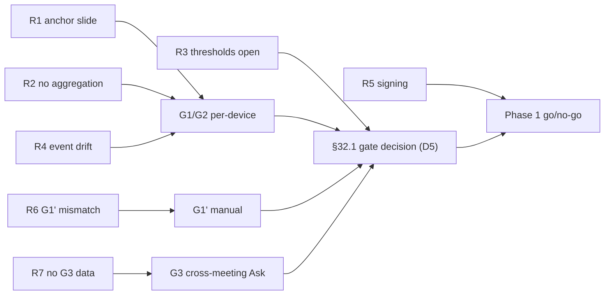

# Risk register

Status: dated risk snapshot for `develop@3bfe144`; current execution blockers and status live in
[`06-roadmap.md`](06-roadmap.md). Do not execute directly from this snapshot.

Delivery risks for the active product roadmap (`06-roadmap.md`), using the unified architecture
for gate, integration, and decision background (§32.1, §33, §36, §37). Risks only — realized
problems move to the issue tracker or roadmap. Verified against the working tree at
`develop@3bfe144`; see Sources below for what was actually inspected.

## Sources

- `docs/COMPANION_UNIFIED_ARCHITECTURE.md` — §32.1 (gate signals G1/G2/G3/G1'), §33 (risk ratings), §37 D3/D9 (signing spike), ADR-008 (native messaging).
- `docs/companion-product-architecture-roadmap.md` — historical input only; superseded sections were not used.
- `packages/exporters/src/gate.ts` — 200-event capped audit ring, `GATE_EVENT = 'export.obsidian'`, documented anchor assumption.
- `apps/extension/src/components/SummaryView.tsx` — `appendAudit(GATE_EVENT, meeting.id)` on export.
- `packages/store/src/schema.ts`, `packages/store/src/store.ts` — `AskResult.evidence_refs` exists; no G3 aggregation.

## How to read

- **Owner** is the accountable Hermes profile; multiple contributors allowed, one owner.
- **Trigger** is an observable condition that converts the risk into an issue with a dated action — not a hunch.
- **Likelihood / impact** use the §33 Low–High scale; ordering below is by delivery impact, not by ID.
- No telemetry anywhere in this register: every signal is a local audit-log or manual-log artifact (§32.1).

## Register

| ID | Risk | Impact | Likelihood | Mitigation | Owner | Trigger |
|---|---|---|---|---|---|---|
| R1 | Probe false negatives: heavy usage evicts export events from the 200-entry audit ring, so the anchor (oldest surviving event) slides forward and week-2 windows undercount G1/G2 | Medium | Medium | Keep the documented single-user anchor assumption in `gate.ts`; gate review checks ring age before trusting week-2 slices; export counts near release are measured, not inferred | pak-deadlineo | Anchor moves > 3 days forward on an active device, or ring holds no release-week events |
| R2 | Gate without cross-device aggregation: `gateSummary` produces per-device numbers only; no collector computes fleet G1 (≥ 30%) / G2 (≥ 50%), so §32.1 cannot actually be evaluated | High | High | Add a manual aggregation step to the gate review: per-device gate summaries are collected and summed into G1/G2 before any Phase 1 go/no-go | pak-prdono | Phase 1 review scheduled and no aggregate G1/G2 number exists |
| R3 | Thresholds G1/G2 not frozen: §32.1 defaults (30% / 50%) are "proposed" and tunable once before the probe ships; post-hoc tuning would invalidate the probe as demand evidence | Medium | Medium | Freeze thresholds in a dated decision before probe release and record it in the decision log; no changes after results arrive | pak-deadlineo | Probe ships without a dated threshold-freeze entry |
| R4 | `export.obsidian` event contract drift: SummaryView, `gate.ts`, and any future collector must agree on event name, payload (`meeting.id`), and `AuditEvent.time` format; silent drift zeroes G1/G2 while the export feature still works | High | Low | `GATE_EVENT` stays the single constant in `packages/exporters/src/gate.ts`; a contract test pins the event name and payload shape | pak-arsitekno | Any second literal `'export.obsidian'` or payload-shape change lands in a diff |
| R5 | Windows signing unproven: the D3/D9 native-messaging spike has a hard 5-day timebox, but Authenticode (USD 200–500/yr) and clean-VM results A1–A5 are not yet evidenced; §33 rates install failure medium/high | High | Medium | Run the D9 spike on schedule and append dated Results to `docs/spike-native-messaging-installer.md`; go/no-go before Phase 1 commits | pak-deployo | Spike day 5 reached without A1–A5 passing on all three OS |
| R6 | Anchor drift also breaks G1' comparability: the manual 3-week self-audit and ring-derived windows stop matching once the ring slides, so the single-user fallback signal reads wrong | Low | Medium | Record the device anchor date alongside each manual G1' entry; compare window starts, not wall-clock weeks | mbak-dewi | Two consecutive G1' weekly entries disagree with ring-derived windows |
| R7 | G3 not instrumented: §32.1 measures cross-meeting Ask via `AskResult.evidence_refs`, but nothing in `packages/ai` or `packages/store` counts distinct-meeting citations weekly — the only gate signal that can fire Phase 1 alone has no data source | High | High | Add local evidence-ref counting (distinct `meeting_id` per query, weekly bucket in the audit ring) before the 6-week gate review | mas-arus | Gate review enters week 4 with no G3 counter shipping in a build |

## How the register maps to the gate decision

## Escalation and review cadence

Each owner re-checks their triggers weekly until the §32.1 gate decision, at most 6 weeks from probe release. A triggered risk becomes an issue with an owner and a dated action — recorded as an issue, never folded back into this register. An unmitigated high-impact trigger (R2, R4, R5, R7) pauses the Phase 1 review; it does not pause or extend the probe itself. Escalation path: owner → pak-deadlineo → the owner's product gate decision (D5).

## Status snapshot

All seven risks are currently Open and untriggered. First full pass: gate review kickoff. No risk here is a claim about shipped behavior — R1 and R4's mechanics are code-verified, R2, R3, R5, R6, R7 are gaps by absence of an artifact.
