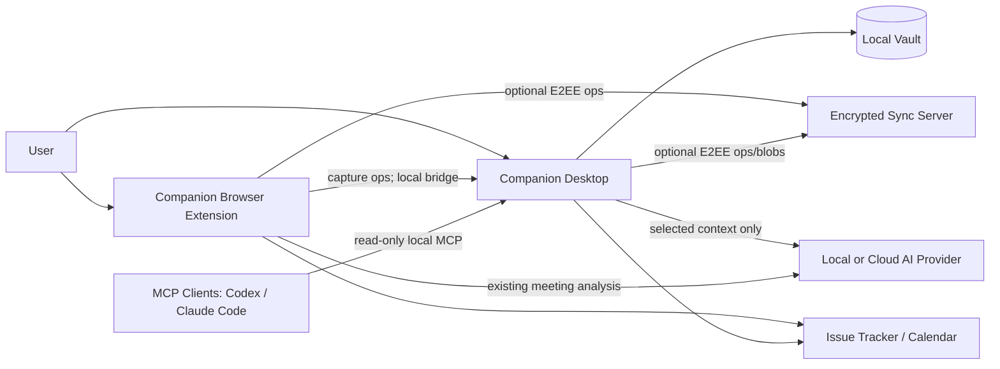
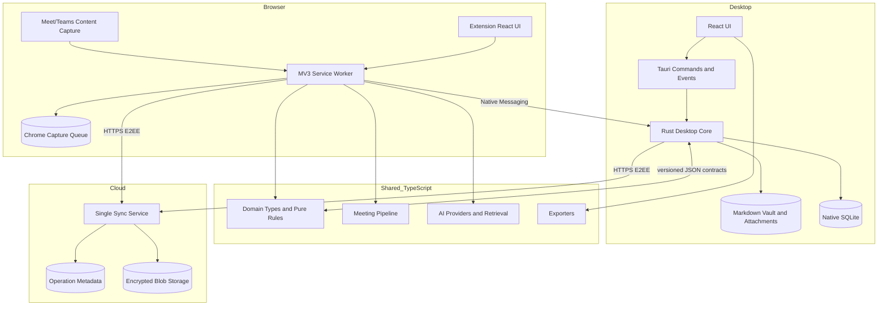
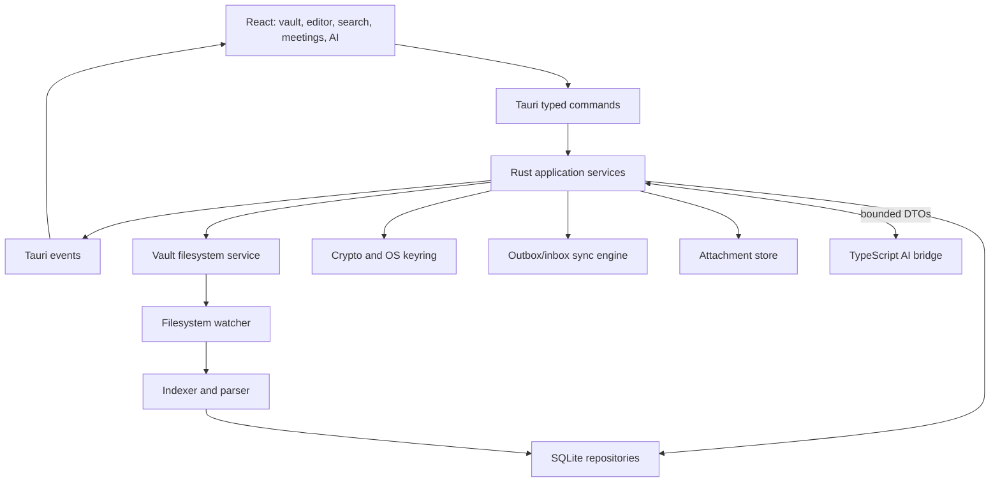
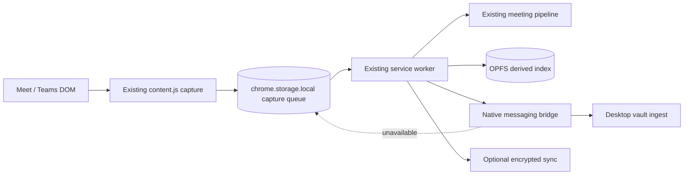
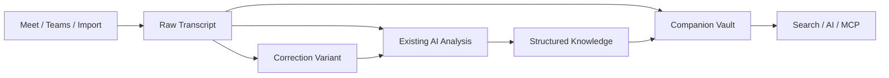
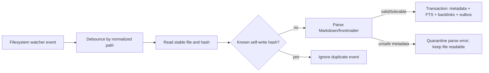
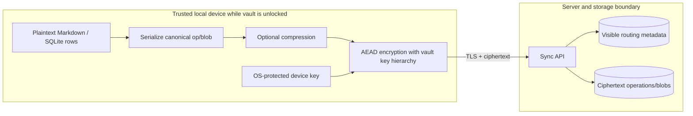
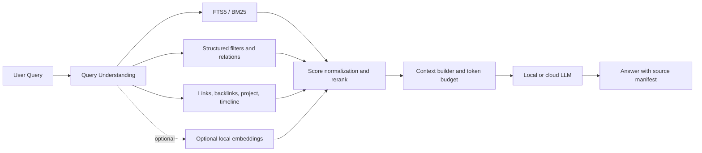
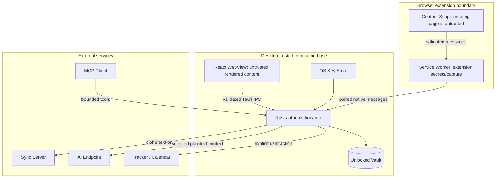

# Companion Unified Architecture

## Local-First AI Knowledge Workspace, Meeting Companion & Encrypted Sync

Status: target architecture, implementation-oriented
Roadmap status: architectural background; [`06-roadmap.md`](06-roadmap.md) governs product
sequencing, current stage, and desktop scope gates.
Supersedes: where the 2026-08-24 product roadmap (`companion-product-architecture-roadmap.md`) conflicts with this document, this document wins; that file now carries a staleness banner listing its superseded sections.
Evidence baseline: branch `develop`, commit `3bfe1449ba89302d0cc12c7be2dc6c027fc26d80`, verified against `origin/develop` on 2026-08-27
Decision horizon: personal, single-user, multi-device Companion; team collaboration is not an MVP requirement

This document uses **MUST**, **SHOULD**, **MAY**, and **NOT NOW** as normative priorities. **Needs validation** means the repository does not yet contain executable evidence for the claim or target.

## 1. Executive Summary

Companion becomes one local-first personal knowledge system with two application surfaces:

- the browser extension captures meeting knowledge and remains useful without the desktop;
- the Tauri desktop application is the primary workspace for notes, documents, meetings, search, AI, and vault management;
- the local vault is authoritative; the sync server stores encrypted operations and blobs but is not an application backend or plaintext knowledge store;
- the existing TypeScript meeting pipeline, provider abstraction, structured-memory model, provenance rules, exporters, SQLite repositories, and read-only MCP behavior are evolved instead of rewritten.

The recommended canonical model is **Option B, a deliberately limited hybrid**:

- human-authored notes and long-form documents are canonical Markdown files;
- meetings, raw transcript lines, correction variants, decisions, action items, risks, questions, AI conversations, sync state, and version metadata are canonical structured records in local SQLite;
- a meeting Markdown page is the canonical human annotation linked to the structured meeting, not a duplicate canonical transcript;
- FTS5 indexes, backlinks, graph edges inferred from Markdown, optional embeddings, previews, and caches are derived and rebuildable.

The recommended extension/desktop topology is **Architecture C, Hybrid**. When desktop is available, the extension forwards stable capture operations through a native-messaging bridge. It always retains a temporary `chrome.storage.local` recovery copy. E2EE cloud sync is optional and carries the same operation IDs, allowing deduplication when an operation arrives through both paths.

The MVP intentionally excludes CRDTs, mandatory embeddings, a vector database, WebSocket, multi-user live editing, and microservices. Markdown conflicts use base-version-aware three-way merge with a visible conflict copy. Structured records use optimistic logical versions and field-aware reconciliation. HTTPS polling and batch upload are sufficient until measured product demand proves realtime push is necessary.

## 2. Current Architecture Audit

### 2.1 Evidence and repository state

The audit inspected application and package source, tests, schemas, manifests, and package dependencies. It did not infer the implementation solely from README documentation. Primary source anchors are:

- [`apps/extension/public/content.js`](../apps/extension/public/content.js): unbundled Meet/Teams DOM capture and `chrome.storage.local` writes;
- [`apps/extension/src/background.ts`](../apps/extension/src/background.ts): MV3 orchestration, AI calls, retention, notifications, and runtime-message boundary;
- [`apps/extension/src/db.ts`](../apps/extension/src/db.ts): service-worker ownership of OPFS SQLite and application operations;
- [`packages/shared/src/types.ts`](../packages/shared/src/types.ts), [`storage.ts`](../packages/shared/src/storage.ts), and [`crypto.ts`](../packages/shared/src/crypto.ts): domain types, browser persistence, credentials, and encrypted envelopes;
- [`packages/meeting/src/pipeline.ts`](../packages/meeting/src/pipeline.ts), [`sync.ts`](../packages/meeting/src/sync.ts), and [`import.ts`](../packages/meeting/src/import.ts): meeting lifecycle, current sync, and imports;
- [`packages/store/src/schema.ts`](../packages/store/src/schema.ts), [`store.ts`](../packages/store/src/store.ts), and [`ingest.ts`](../packages/store/src/ingest.ts): SQLite schema, queries, and derived-index rebuild;
- [`packages/ai/src/client.ts`](../packages/ai/src/client.ts), [`providers.ts`](../packages/ai/src/providers.ts), [`retrieval.ts`](../packages/ai/src/retrieval.ts), and [`ask.ts`](../packages/ai/src/ask.ts): provider strategy and grounded retrieval;
- [`packages/mcp/src/tools.ts`](../packages/mcp/src/tools.ts) and [`server.ts`](../packages/mcp/src/server.ts): snapshot-backed read-only MCP;
- [`packages/sync-server/src/server.ts`](../packages/sync-server/src/server.ts) and [`store.ts`](../packages/sync-server/src/store.ts): current HTTP protocol and opaque file storage;
- [`packages/exporters/src/markdown.ts`](../packages/exporters/src/markdown.ts), [`pdf.ts`](../packages/exporters/src/pdf.ts), and [`docpdf.ts`](../packages/exporters/src/docpdf.ts): framework-free exports.

### 2.2 Package responsibilities and reuse decision

| Area | Existing responsibility observed in source | Coupling / limitation | Target disposition |
|---|---|---|---|
| `apps/extension` | MV3 React dashboard, background service worker, plain-JS content capture, Chrome permissions and OPFS owner | `background.ts` and `db.ts` contain many browser adapters and application use cases; capture must write Chrome storage | **Keep** capture/UI; reduce desktop-like workspace scope; add bridge adapter without breaking standalone mode |
| `packages/shared` | Meeting/analysis types, storage key conventions, session identity, transcript provenance helpers, browser-backed secret storage, passphrase encryption | `storage.ts` and at-rest `crypto.ts` directly use `chrome.*`; domain and browser adapters share one package | **Split by exports, then packages only when needed**: keep portable domain helpers; move Chrome storage/credential adapter to extension-owned code; preserve data formats |
| `packages/ai` | `AIClient.complete`, provider presets/adapters, OAuth protocol, analysis, cleanup, document generation, lexical retrieval, grounded Ask | Fetch/browser provider constraints live beside pure prompts; abstraction supports completion but not streaming/tool calls/capability discovery | **Keep and extend** with capability metadata and tool orchestration; do not replace provider strategy |
| `packages/meeting` | analysis pipeline, finish detection, imports, continuity, global Ask, trackers, calendar, current sync | Depends on `@meetcc/store`; `sync.ts` is session-bundle/LWW and browser-shaped WebCrypto | **Keep meeting domain/use cases**; extract v2 sync protocol from current meeting package so knowledge sync is not meeting-only |
| `packages/store` | SQLite driver boundary, schema migration, meeting repositories, FTS5, structured memory, evidence links, outbox | SQLite is currently a rebuildable OPFS index while several UI mutations exist only in SQLite; store is meeting-centric | **Evolve** into shared repository contracts and TypeScript OPFS implementation; desktop gets a Rust implementation of the same versioned contracts |
| `packages/mcp` | offline stdio MCP over explicit exported snapshot; nine read-only tools; returns evidence instead of generating answers | Snapshot is stale/manual and meeting-only; external process cannot read Chrome OPFS | **Keep read-only policy and tool semantics**; desktop serves live local vault data through a narrow local RPC boundary |
| `packages/sync-server` | bearer-token auth, token→workspace isolation, `PUT /sessions/:id`, cursor-like `GET /sessions?since=`, opaque encrypted payload storage, atomic rename | LWW per meeting; timestamp cursor can collide; no op IDs, deletes, attachment protocol, device lifecycle, history, resumable upload, or hosted identity | **Extend in place with versioned v2 routes**; retain v1 for migration; replace record semantics, not the deployable-service shape |
| `packages/exporters` | pure Markdown, PDF, document-PDF, checklist, and iCalendar generation; DOM rasterization remains in UI | meeting-specific input types and branding | **Keep**; add knowledge-document adapters without moving filesystem logic into exporter code |

### 2.3 Current dependency direction

Observed workspace dependencies are:

```text
apps/extension
  -> packages/shared
  -> packages/ai -> packages/shared
  -> packages/meeting -> packages/{shared,ai,store}
  -> packages/store -> packages/shared
  -> packages/exporters -> packages/shared

packages/store -> packages/shared
packages/mcp -> packages/{shared,store}
packages/sync-server -> Node.js standard library only
```

This mostly honors the existing rule that React stays in the app layer. `apps/extension/src/db.ts` directly imports `@meetcc/store`, although `apps/extension/package.json` does not declare that workspace dependency; the root TypeScript path mapping currently masks the manifest drift. The important architectural inversion to address is that `packages/meeting` imports the concrete `CompanionStore` for global knowledge and sync use cases. The target should pass a minimal repository capability into those use cases, not create a broad abstract repository framework.

### 2.4 Existing domain and lifecycle

The current portable domain includes `Meeting`, `MeetingMeta`, `Entry`, `Analysis`, `Decision`, `ActionItem`, `EvidenceSpan`, `AskResult`, `ChatMessage`, generated document types, provider/settings types, and audit events. A room is already distinct from a session: `resolveSession` creates `<room>#<start-ms>` IDs and resumes within a five-minute window.

Current meeting flow, verified from source:

1. `content.js` recognizes Meet or Teams, polls caption DOM, coalesces speaker text, and writes `transcript:<sessionId>` plus `meta:<sessionId>` heartbeats to `chrome.storage.local`.
2. The service worker resolves recurring room links into distinct sessions.
3. The minute sweep treats a silent heartbeat plus at least five entries as a finished meeting.
4. `runPipeline` records processing state, calls the configured provider, validates analysis output, persists it, derives a title, audits, and notifies.
5. `ingestAll` copies the Chrome storage state into OPFS SQLite and verifies transcript counts. The Chrome copy remains the current rollback source.
6. AI cleanup never overwrites raw transcript lines; `effectiveClean` preserves rejected corrections and appends newly captured raw lines.
7. Structured decisions/actions/questions/risks are extracted into SQLite; evidence links resolve back to raw transcript entry keys.

### 2.5 Current storage, search, encryption, MCP, sync, and export

- Storage keys in `chrome.storage.local` are the current canonical capture/archive format. OPFS SQLite is documented and implemented as derived data rebuilt by `ingestAll`.
- SQLite schema version 5 contains rooms, sessions, participants, raw/clean transcript entries, analyses, decisions, action items, questions, risks, evidence references, documents, chats, projects, highlights, templates, key/value state, and a meeting-level sync outbox.
- Search combines external-content FTS5 for transcript, an FTS5 memory surface for structured memory/documents, BM25 ordering, filters, and evidence-window expansion. There is no vector store.
- AI provider credentials are AES-GCM encrypted, but the extractable AES key is stored in the same Chrome profile. Source comments correctly limit this to protection from casual dumps, not a compromised profile.
- Current sync derives a new AES-GCM key per payload using PBKDF2-HMAC-SHA256 and a passphrase. The server stores ciphertext but sees workspace, session ID, and update time.
- MCP is read-only, local stdio, and snapshot-backed. It exposes meeting listing/search/read/evidence tools; the calling agent performs reasoning.
- Exporters produce meeting Markdown, branded PDF, generated-document PDF, task checklist, and ICS without importing React or Chrome APIs.

### 2.6 Technical debt and architectural coupling

| Finding | Evidence | Impact |
|---|---|---|
| Two local truths already exist for some mutations | Chrome capture is canonical, but action status, project assignment, calendar match, tracker refs, templates, and pulled sessions live in SQLite | A full rebuild from Chrome storage cannot reproduce every current user mutation |
| Sync identity is a timestamp | client cursor and server order use ISO `updatedAt` | equal timestamps, wrong clocks, and failed decrypts can skip or stall records |
| Sync conflict unit is a whole meeting | `SessionBundle` and server `StoredRecord` replace by meeting | one metadata edit can compete with transcript growth; deletes and history are absent |
| Server suppresses storage errors as missing | `SyncStore.get` catches unreadable and missing alike | corruption cannot be distinguished from absence in operations/diagnostics |
| Browser package boundary is porous | shared storage/crypto call `chrome.storage`; extension `db.ts` dispatches many domain actions | desktop cannot reuse these files directly without adapters |
| Extension dependency manifest is incomplete | `apps/extension/src/db.ts` imports `@meetcc/store`, but `apps/extension/package.json` omits it | workspace/path resolution succeeds today, while isolated package installation and dependency analysis are misleading |
| Provider interface is completion-only | `AIClient` has one `complete` method | tools, streaming, embeddings, and model capabilities need additive contracts |
| MCP snapshot is manual | server reads an exported JSON file and reloads on mtime | no live desktop vault, no note/document knowledge, and revocation is file access only |
| Evidence for structured memory is retrieval-derived | `evidenceFinder` chooses the best lexical span after analysis | useful, but not equivalent to model-emitted exact source references; false linkage remains possible |
| Generated documents cite timestamps as prompt policy | citations are not structurally parsed/verified like `AskResult` entry IDs | generated Markdown provenance is weaker than Ask provenance |
| Deletion has no undo in extension retention path | storage keys and SQLite session are removed | conflicts with the target desktop restore/version-history requirement |

## 3. Problems & Architectural Gaps

The main gap is not a missing desktop shell; it is the lack of one canonical knowledge and sync model shared by capture, desktop, MCP, and multi-device operation.

| Current | Problem | Proposed | Why | Migration impact |
|---|---|---|---|---|
| Chrome storage is capture archive; OPFS SQLite is derived | Desktop cannot safely treat Chrome profile storage as its vault | Desktop vault becomes authoritative after explicit import/connection; extension keeps a durable capture queue | Keeps capture resilient and gives desktop user-owned files/database | Non-destructive import, count/hash verification, rollback to extension |
| Meeting-only domain | Notes, attachments, tags, links, and projects are not first-class knowledge | Add minimal `Document`, `Link`, `Tag`, `Attachment`, and versioned entity records around existing meeting types | Extends current model without recasting meetings as generic blobs | Existing meeting IDs and analysis JSON remain valid |
| Session bundle sync + LWW | No per-entity concurrency, delete, resume, or history | Append immutable encrypted operations with server cursor and content-addressed blobs | Idempotent retry and independent conflict policies | v1 server remains readable while clients emit v2 after import |
| Chrome-profile key storage | Does not protect a stolen/unlocked browser profile | Desktop vault master key wrapped by OS secret storage; explicit recovery/enrollment | Separates vault encryption identity from account auth | Credentials are re-entered or transferred only by approved flow |
| Manual MCP snapshot | Stale and meeting-only | Desktop-owned read-only MCP queries live local repository through authenticated local IPC | Live data without exposing database files | Snapshot mode remains supported for extension-only users |
| Completion-only AI | No controlled knowledge mutations | Add tool engine above provider interface; preserve completion path | Avoids hardcoding one provider and centralizes permissions | Existing analysis/Ask remain unchanged during transition |
| Meeting-specific FTS | Cannot search vault files/tags/links | Expand local SQLite FTS and structured filters; optional embeddings later | Existing lexical retrieval is already useful and private | Rebuild index from canonical Markdown + structured records |

## 4. Product Vision

Companion is a local-first personal knowledge operating system in which:

- browser surfaces capture knowledge at its source;
- desktop organizes, edits, searches, links, exports, and reasons over that knowledge;
- meetings are native knowledge objects connected to projects, people, notes, decisions, actions, risks, questions, and other meetings;
- AI is a local retrieval and tool layer, not an ungrounded sidebar;
- MCP provides controlled access to the same local knowledge model;
- cloud infrastructure authenticates devices and relays encrypted state, but does not become the primary runtime or plaintext source of truth.

The existing extension remains a complete meeting assistant. Installing the desktop expands the same Companion data system; it does not create a second product.

## 5. Architectural Principles

1. **MUST — Local device is primary.** Every core desktop read/write/search/export path works with no network, no account session, and no cloud provider.
2. **MUST — Explicit canonical ownership.** Each datum has one canonical representation per local vault; mirrors and indexes declare rebuild rules.
3. **MUST — Preserve raw evidence.** Raw transcript capture is immutable except explicit redaction; correction and analysis create versions.
4. **MUST — Client-side encryption for synced content.** Authentication never gives the server a vault key.
5. **MUST — Migration is reversible.** Existing Chrome storage is not deleted during import or verification.
6. **SHOULD — Markdown for human-authored knowledge.** Files remain readable in ordinary editors and usable without Companion.
7. **SHOULD — SQLite for structured state and derived retrieval.** Use transactions and FTS5 already present in the codebase.
8. **SHOULD — Reuse portable TypeScript behavior.** Move only OS-critical or reliability-sensitive operations into Rust.
9. **SHOULD — Protocols are idempotent and versioned.** Duplicate, retry, and out-of-order delivery are normal conditions.
10. **MAY — Optional local semantic retrieval.** It augments lexical/structured retrieval and can be removed/rebuilt.
11. **NOT NOW — CRDT, vector server, WebSocket, microservices, collaborative web editor, or enterprise workspace.** Add only after measured requirements invalidate the simpler design.

## 6. Target System Architecture

### 6.1 System context



### 6.2 Target component architecture



The Rust/TypeScript line is a serialized command/event contract, not shared in-process business logic. TypeScript continues to own existing AI prompt/provider behavior and meeting analysis. Rust owns desktop filesystem, native SQLite, file watching, cryptographic key custody, blob I/O, and sync durability.

## 7. Component Responsibilities

| Component | MUST own | MUST NOT own |
|---|---|---|
| Extension content script | DOM selectors/heuristics, caption normalization, stable capture operation IDs, heartbeat | AI keys, vault key, desktop filesystem, global knowledge queries |
| Extension service worker | capture queue, existing meeting analysis, bridge/sync adapter, Chrome permissions | desktop canonical file edits, cloud plaintext |
| Desktop React | presentation, editor state, explicit user intent, permission/confirmation UI | direct filesystem/database/key access; sync state machine |
| Tauri IPC | schema validation, command authorization, progress/events, cancellation | duplicated domain rules or provider-specific prompts |
| Rust desktop core | vault operations, native SQLite, watcher, atomic write journal, sync engine, attachment hashing/encryption, OS keyring | React view logic; provider prompt implementation unless a local runtime requires a native adapter |
| Shared TypeScript domain | current meeting/analysis types, portable validation, canonical wire DTO schemas, pure rules | `chrome.*`, Tauri APIs, filesystem calls |
| AI engine | provider routing, query planning, retrieval orchestration, context/provenance, tool planning | bypassing permission checks or writing storage directly |
| Sync server | auth, device/vault membership, opaque op/blob persistence, cursors, quotas | vault keys, decryption, search, AI, merge decisions |
| MCP server | authenticated local read tools, bounded output, provenance | writes in MVP, raw DB access by client, cloud relay |

## 8. Desktop Architecture

### 8.1 Local component diagram



### 8.2 React/TypeScript versus Rust boundary

| Responsibility | Owner | Reason |
|---|---|---|
| Markdown editor and preview | React/TypeScript | UI concern; reuse web ecosystem without moving business rules into components |
| Link/tag syntax presentation | React; parsing result from core | consistent highlighting while canonical parsing/indexing stays centralized |
| Existing AI providers, prompts, parsers, cleanup, analysis | TypeScript packages | mature tested code already exists; Rust rewrite adds no user value |
| AI tool UI and confirmation | React/TypeScript | user intent and preview belong at interaction boundary |
| Tool authorization and mutation execution | Rust application service | cannot trust model/UI payloads with filesystem access |
| Vault path validation, read/write/move/trash | Rust | native filesystem correctness and traversal protection |
| SQLite and migrations | Rust desktop core | native durability, FTS5, transactions, no browser WASM constraint |
| File watcher/debounce/hash/self-write suppression | Rust | OS integration and consistent crash behavior |
| Sync outbox/inbox, cursor, retries | Rust | must survive UI restarts and provider failures |
| Vault/attachment encryption and keyring | Rust | smallest key-bearing trusted surface |
| Local AI endpoints such as Ollama/LM Studio | existing TypeScript HTTP adapter first | already supported through OpenAI-compatible API |
| Embedded llama.cpp/MLX runtime | **MAY, later Rust adapter** | only if product evidence demands bundled inference; platform packaging is **Needs validation** |

The desktop MUST expose narrow commands such as `read_document`, `write_document`, `search`, `apply_tool_mutation`, and `sync_now`. It MUST NOT expose generic `execute_sql`, arbitrary path reads, or shell execution.

### 8.3 Desktop offline contract

No network call is on the critical path for opening, editing, linking, searching, exporting, or browsing meetings. Cloud AI failures leave local retrieval results available. Local AI is used only when configured and healthy; an unavailable model does not block vault operations.

## 9. Extension Architecture



The current Meet/Teams selectors, avatar heuristic, 500 ms capture cadence, heartbeat semantics, session resolution, minimum-entry finish rule, cleanup provenance, imports, trackers, provider settings, archive, and exports remain intact.

Extension evolution:

- **MUST** assign a stable `operationId` and `deviceId` to capture batches before either bridge or cloud delivery;
- **MUST** retain batches until the desktop or server acknowledges the exact operation ID;
- **MUST** continue extension-only behavior when desktop is absent;
- **SHOULD** send append batches rather than whole transcript arrays to desktop, while preserving current array storage as the rollback representation during migration;
- **MUST NOT** grant the content script desktop credentials or a vault key;
- **MUST** keep `manifest.json` and `content.js` host support aligned.

## 10. Unified Knowledge Model

### 10.1 Core identities

All canonical entities use stable locally-generated IDs: **UUIDv7 (RFC 9562)**, finalized in ADR-013 (accepted 2026-08-27; platform validation passed — see the ADR for dated results and the pre-approved UUIDv4 fallback). Existing meeting session IDs are preserved as external/legacy IDs and receive a stable internal `meeting_id` mapping during import; a linked human-authored meeting note has its own `document_id`. Capture-level session identity (`<room>#<start-ms>`, including fallbacks such as `tms-<epoch-ms>`) is stored on the canonical meeting as `session_key` (UNIQUE), so re-capture and re-import stay idempotent (ADR-013).

| Entity | Key relationships | Provenance |
|---|---|---|
| `Vault` | contains documents, meetings, attachments, devices | local path + vault ID |
| `Document` | Markdown path, links, tags, optional project/person relations | path, heading/block locator, content hash, version |
| `MeetingSession` | room, participants, project, note document, transcript | capture device, platform, start/end, legacy ID |
| `TranscriptLine` | meeting, raw line ID, speaker, time, correction versions | immutable raw capture operation and sequence |
| `Decision` | meeting/document evidence, project/topic, revises decision | source refs and version |
| `ActionItem` | source, owner/person, project, due/status, tracker ref | source refs and mutation audit |
| `Question` / `Risk` | source meeting/document and lifecycle | source refs |
| `Project` / `Person` / `Tag` | links to documents and structured entities | explicit metadata or derived mention marker |
| `Attachment` | content hash, local object path, document links | originating document/op and MIME metadata |
| `AIConversation` / `AIMessage` | selected scope, model/provider, citations | context manifest and tool audit |

### 10.2 Meeting knowledge flow



Meeting is not flattened into one Markdown file. It is a structured aggregate with a linked human-editable meeting note. Internal links can target `[[Meeting Title]]`, while the resolved link stores a stable document/meeting ID so renames do not break relationships.

## 11. Canonical Storage

### 11.1 Options considered

| Option | Strength | Failure / cost | Decision |
|---|---|---|---|
| A — Markdown canonical + SQLite derived for everything | maximum portability and easy external editing | transcript scale, per-line provenance, action status, tracker refs, concurrent field updates, and typed lifecycle become awkward frontmatter/file rewrites | Reject as universal model |
| B — Structured SQLite canonical for stateful entities + Markdown canonical for notes | reuses current SQLite model; clear transactions; file-friendly where humans edit | two canonical media require explicit transaction/recovery boundaries | **Choose** |
| C — event/document model as universal canonical store | excellent history and sync replay | introduces an event-sourcing platform before requirements justify it; Markdown still needs materialization | Reject as local universal model; reuse immutable ops only as sync/history transport |

### 11.2 Definitive source-of-truth map

| Data | Canonical source on desktop | Derived / cache | Synced |
|---|---|---|---|
| User note and research document | Markdown file | parsed AST metadata, FTS rows, backlinks, preview, embeddings | encrypted content/version ops |
| Meeting identity and metadata | SQLite `meeting_sessions` successor | meeting Markdown projection, recents | encrypted entity ops |
| Raw transcript | SQLite immutable `transcript_lines` keyed by stable line ID | FTS, speaker aggregates, export text | encrypted append ops |
| Transcript correction | versioned SQLite correction record referencing raw/base hash | effective transcript view and FTS | encrypted version ops |
| Human meeting note | Markdown file linked to meeting | FTS/backlinks | encrypted content/version ops |
| AI analysis snapshot | versioned SQLite record with provider/time/schema/context manifest | rendered summary, search rows | encrypted version ops |
| Decision/action/question/risk after extraction | SQLite structured record; extraction becomes canonical only when persisted and then may be user-edited | FTS, rollups, overdue lists | encrypted entity ops |
| Generated BRD/PRD/notulen saved by user | Markdown file | PDF rendering and FTS | encrypted content/version ops |
| Attachment | content-addressed file under `.companion/objects` plus SQLite metadata | thumbnails/previews | encrypted blob + metadata op |
| Link/tag/project/person relations explicitly edited | SQLite record and/or Markdown syntax/frontmatter according to origin | backlinks and inferred mention edges | explicit record or document content |
| Search index/backlinks/graph/embeddings | none; fully derived | SQLite index tables | no; rebuild locally |
| Sync cursors/outbox/inbox/device state | local SQLite operational state | retry scheduling | only protocol acknowledgements/ops needed by peers |

Therefore:

- source of truth for a **meeting** is the local SQLite meeting aggregate;
- source of truth for the **raw transcript** is immutable structured SQLite lines, with the extension queue serving as pre-ingest recovery source;
- source of truth for a **user note** is Markdown;
- source of truth for a **decision/action item** is a versioned SQLite record once persisted, not a repeatedly regenerated AI projection;
- derived data includes FTS, backlinks, graph edges, previews, inferred entities, and optional embeddings;
- sync includes canonical files/records, their tombstones and version metadata, attachment blobs, and necessary encrypted history—not local indexes or caches.

## 12. SQLite Schema Direction

### 12.1 Data classification

| Table/domain | Classification | Notes |
|---|---|---|
| `documents` | canonical metadata; Markdown body remains canonical file | stable ID, path, hash, kind, timestamps, deletion state |
| `meeting_sessions`, `transcript_lines` | canonical | preserve legacy IDs and evidence keys; raw lines immutable |
| `decisions`, `action_items`, `questions`, `risks` | canonical | add stable IDs, logical version, updated-by device, provenance, tombstone |
| `projects`, explicit `entities`, explicit `tags` | canonical | inferred mentions are separate derived rows |
| `links` | canonical when explicit structured link; derived when parsed from Markdown | record `origin` to avoid ambiguity |
| `attachments` | canonical metadata | binary body is a content-addressed file |
| `versions` | canonical bounded history | snapshots for documents/analysis; mutation records for structured entities |
| `ai_conversations`, `ai_messages` | canonical if user chooses to retain | local-only option per conversation |
| `sync_outbox`, `sync_inbox`, `sync_state`, `devices` | canonical operational state | required for retry/dedupe/recovery, but not user knowledge |
| `search_fts`, `backlinks`, `tag_index`, `entity_mentions` | derived | rebuild from Markdown and canonical structured records |
| `embedding_chunks` | cached/derived | optional; include model/version/content hash |
| editor draft buffers, transient AI streams | ephemeral | crash recovery MAY retain bounded encrypted drafts |

### 12.2 Directional schema, not final migration SQL

```text
documents(id, path, kind, content_hash, logical_version, deleted_at, created_at, updated_at)
meeting_sessions(id, legacy_id, room_id, platform, title, project_id, note_document_id, logical_version)
transcript_lines(id, session_id, seq, speaker_id, raw_text, started_at, capture_op_id)
transcript_corrections(id, line_id, base_hash, corrected_text, status, version_id)
knowledge_entities(id, kind, title, logical_version, deleted_at)
decisions/action_items/questions/risks(id, source_id, fields_json, logical_version, deleted_at)
source_refs(id, target_type, target_id, source_type, source_id, locator_json, source_hash)
attachments(hash, byte_length, mime, encrypted_blob_id, local_state)
document_attachments(document_id, attachment_hash, label)
versions(id, object_type, object_id, parent_version, content_hash, snapshot_ref, author_device_id, created_at)
sync_outbox(operation_id, object_id, base_version, logical_version, payload_ref, state, attempts, next_attempt_at)
sync_inbox(operation_id, server_cursor, received_at, applied_at, error_code)
```

The target migrations MUST append to existing migrations; shipped migrations are never edited. Foreign keys MUST be enabled and destructive cascades must be tested. The desktop native schema and browser OPFS schema may differ physically, but their canonical DTO/schema version MUST be shared. Do not force a single SQL dialect abstraction across WASM and native SQLite if it obscures platform-specific reliability.

## 13. Filesystem/Vault Architecture

### 13.1 Proposed vault layout

```text
Companion Vault/
├── Projects/
├── Meetings/
├── Notes/
├── Research/
├── Attachments/
└── .companion/
    ├── companion.db
    ├── objects/
    ├── history/
    ├── recovery/
    └── vault.json
```

`Meetings/` contains human meeting-note Markdown, not raw transcript dumps by default. `Attachments/` may contain user-friendly links/copies; canonical content-addressed objects live under `.companion/objects/`. Internal metadata is documented and portable, but users should not hand-edit `.companion/companion.db`.

Recommended frontmatter remains small:

```yaml
---
companion_id: 018f7f3a-example
type: note
tags: [companion, architecture]
project: Project Companion
created: 2026-08-27T10:00:00+07:00
updated: 2026-08-27T11:30:00+07:00
---
```

Do not mirror all structured records into frontmatter. IDs and user-facing organization belong there; transcript lines, sync vectors, and encryption metadata do not.

### 13.2 Atomic write and transaction boundary

Filesystem and SQLite cannot share an atomic transaction. The safe write protocol is:

1. validate the resolved target remains inside the vault and write a pending filesystem intent in a short SQLite transaction;
2. write a sibling temporary file, flush file contents, atomically rename/replace using the platform-safe Rust implementation, and fsync the containing directory where supported;
3. in one SQLite transaction update document metadata, derived index rows, version snapshot, and sync outbox operation; mark the intent committed;
4. on restart, reconcile pending intents by inspecting target/temp hashes. A committed file with stale/missing index is reindexed; an uncommitted temp is recovered or quarantined.

For ordinary Markdown edits, the file is authoritative: a crash after rename but before SQLite commit is repaired by startup scan. Rename/delete operations need the durable intent because absence alone cannot distinguish user intent from filesystem loss.

### 13.3 External modifications



- debounce is per path, not global;
- hash after the file is stable; watcher events are hints, never facts;
- Companion records hashes of its own writes briefly to suppress feedback loops;
- external rename is correlated using file ID where available and content hash/path events otherwise;
- a moved directory triggers bounded subtree reconciliation rather than immediate full-vault rebuild;
- invalid frontmatter does not make body text inaccessible; diagnostics identify the file and preserve bytes.

## 14. Sync Architecture

### 14.1 Extension/desktop topology alternatives

| Criterion | Architecture A — Server-mediated | Architecture B — Local desktop bridge | Architecture C — Hybrid |
|---|---|---|---|
| Reliability | depends on server/network for handoff | excellent when desktop/host is installed; extension queue covers downtime | highest path diversity, provided operation IDs deduplicate both paths |
| Offline behavior | capture waits locally; desktop sees nothing until both reconnect | desktop receives immediately on same machine; no cross-device path | immediate local handoff plus eventual multi-device sync |
| Browser restrictions | ordinary HTTPS, optional host permission | native-host installation and browser policy constraints; localhost would need port/origin hardening | combines both constraints |
| Security | E2EE required; server sees metadata | native messaging has explicit extension allowlist and no listening port | strongest user choice; larger protocol surface |
| Complexity | simplest client topology, weaker local-first UX | simplest local-first topology, no multi-device capture delivery | moderate; one operation model prevents two independent systems |
| UX | account/server can appear mandatory | desktop pairing/install step | desktop feels immediate; cloud remains optional |
| Duplicated state | extension queue + server + desktop | extension queue + desktop | extension queue + desktop + server, deduped by immutable operation ID |
| Multi-device | supported | absent | supported |

**Decision:** Architecture C. Native Messaging is the primary local bridge because it has an extension-ID allowlist and does not expose a localhost port. A localhost authenticated IPC endpoint is a **MAY** fallback only if native-host installation proves unacceptable on a supported browser. This packaging/installation choice is **Needs validation** on macOS, Windows, Linux, managed Chrome, Edge, and Brave.

### 14.2 Current sync server audit

Current protocol and boundary, verified from `packages/sync-server` and `packages/meeting/src/sync.ts`:

- authentication is a bearer token compared using `timingSafeEqual` and mapped server-side to one workspace;
- `X-Companion-Workspace` must equal the workspace assigned to the token;
- `PUT /sessions/:id` accepts `{sessionId, updatedAt, payload}` up to 32 MiB by default;
- `GET /sessions?since=<iso>` scans one JSON file per session and returns records sorted by `updatedAt`;
- encryption happens in the extension before upload; `payload` is an AES-GCM envelope derived from a user passphrase;
- storage uses per-workspace directories, safe identifier validation, write-temp-then-rename, and no database;
- server-visible metadata includes token/workspace relationship, session identifier, timestamps, sizes, IP/network metadata, and request timing;
- conflict policy is meeting-level last-write-wins; an older/equal timestamp write is an accepted no-op.

The existing server remains a good **single-deployable, opaque-storage baseline**, but its record model is not sufficient for unified knowledge. Reuse its dependency-light HTTP service shape, body limits, TLS posture, workspace isolation tests, opaque payload principle, and atomic local writes. Replace the v2 persistence semantics with immutable operations, monotonic server cursors, devices, tombstones, and blob uploads. Keep v1 routes during migration.

### 14.3 Target operation model

Each local mutation creates one operation before network delivery:

```text
OperationHeader (server-visible minimum)
  protocol_version
  vault_id (opaque random identifier)
  operation_id (globally unique)
  device_id (pseudonymous)
  object_id (opaque random identifier)
  logical_version
  ciphertext_hash
  ciphertext_length

EncryptedOperationBody
  object_kind
  action: create | update | delete | rename | append | attach | detach
  base_version / base_content_hash
  canonical payload or patch
  provenance and author metadata
  client-created timestamp (informational, never ordering authority)
```

The server assigns a monotonically increasing `server_cursor` within a vault when it first accepts an `operation_id`. A unique constraint on `(vault_id, operation_id)` makes retries idempotent. Duplicate delivery returns the original cursor and does not create a second record. Client clocks never determine server ordering.

Client application rules:

- outbox insertion occurs in the same SQLite transaction as canonical structured changes, or after a canonical Markdown atomic write during indexing;
- push batches are bounded by operation count and bytes;
- acknowledgment marks exact operation IDs sent, not “everything before time T”;
- inbox stores operation ID and cursor before apply; apply and applied-state update are transactional for structured records;
- out-of-order object versions remain pending until their base arrives or snapshot recovery resolves them;
- delete is a tombstone with retention, not immediate server erasure;
- device reinstall creates a new device ID. Reusing an old ID requires restoring its private key and monotonic local sequence, so the default is never to reuse it.

### 14.4 Sync sequence

```mermaid
sequenceDiagram
    participant A as Device A
    participant LA as Local DB/Vault A
    participant S as Encrypted Sync Server
    participant LB as Local DB/Vault B
    participant B as Device B

    A->>LA: Commit canonical change + outbox op-123
    A->>S: POST /v2/vaults/{v}/operations (op-123 ciphertext)
    S->>S: Unique(vault, operation_id); assign cursor 884
    S-->>A: accepted cursor 884
    B->>S: GET /v2/vaults/{v}/operations?after=870
    S-->>B: encrypted ops 871..884
    B->>LB: Persist inbox, decrypt, verify, apply or mark conflict
    LB-->>B: applied through cursor 884
    B->>S: optional device checkpoint 884
```

### 14.5 Offline and reconnect

```mermaid
sequenceDiagram
    participant U as User
    participant D as Desktop
    participant O as Local Outbox
    participant S as Sync Server

    U->>D: Edit note while offline
    D->>D: Atomic Markdown write
    D->>O: Queue versioned encrypted operation
    Note over D,O: Search/export continue locally
    D-xS: Network unavailable; bounded backoff
    S-->>D: Network restored
    D->>S: Pull after durable cursor
    D->>D: Reconcile remote bases/conflicts
    D->>S: Retry same local operation IDs
    S-->>D: Existing or new cursor per operation
    D->>O: Mark exact operations acknowledged
```

### 14.6 Transport and server deployment

- **MUST for MVP:** HTTPS request/response for batched operations, initial snapshot/recovery, attachment upload/download, and history.
- **NOT NOW:** WebSocket. Sync on app focus, reconnect, local change debounce, manual action, and short adaptive polling is sufficient. WebSocket may later carry change notifications only; correctness must remain HTTPS/cursor-based.
- **MUST:** one deployable sync service. No Kafka, RabbitMQ, Redis cluster, Elasticsearch, Kubernetes, service mesh, or separate AI service.
- **Hosted path:** PostgreSQL is justified when durable multi-tenant operation ordering, uniqueness, device membership, and quota accounting exceed filesystem simplicity. Encrypted attachment bodies use S3-compatible object storage such as S3 or R2.
- **Self-host path:** SQLite metadata plus filesystem encrypted blobs is sufficient initially and is the closest evolution of `SyncStore`. MinIO is optional when an operator already runs S3-compatible storage.
- **Needs validation:** actual hosted concurrency, retention, and availability requirements before selecting PostgreSQL as mandatory. Do not build two elaborate persistence frameworks; keep one narrow storage interface at the operation/blob boundary.

## 15. Conflict Resolution

### 15.1 Alternatives

| Method | Fit | Decision |
|---|---|---|
| Last-write-wins | simple, but wrong clocks and whole-object overwrite lose edits | reject as default; acceptable only for disposable preferences |
| Version vector | precise causality across devices | use compact per-object base/version metadata only if concurrent histories require it; full vectors are **Needs validation** |
| Optimistic versioning | simple detection using base version/hash | **use for canonical records and documents** |
| Operation log | good retry/history transport | **use for sync and audit**, not as the only local read model |
| CRDT / Automerge / Yjs | strong for character-level concurrent live editing | **NOT NOW**; binary/state overhead and complexity are unjustified for personal asynchronous editing |
| Three-way merge | natural for Markdown with a common base | **use for Markdown** |
| Git-like repository | proven merge/history but exposes repository mechanics and file churn | do not require Git; users may version their vault independently |

### 15.2 Per-data conflict policy

| Data | Policy |
|---|---|
| Markdown note/document | compare `base_content_hash`; fast-forward if unchanged, otherwise three-way line merge against retained base snapshot; clean merge creates new version; unresolved merge writes `<name>.conflict-<device>-<timestamp>.md` and surfaces a resolver |
| Rename/move | stable document ID wins over path identity; concurrent move+edit applies edit to ID then resolves path; two destination paths create a visible path conflict |
| Delete vs edit | never silently discard edit; retain tombstone plus orphaned edited version and ask restore/delete |
| Transcript append | stable line/capture-op IDs; union and deterministic sequence ordering; duplicate append is a no-op |
| Transcript correction | correction references raw line/base hash; concurrent corrections remain alternatives until selected |
| Meeting metadata | merge disjoint fields; same-field different values create conflict record; timestamps are audit information only |
| Decision/action/question/risk | optimistic logical version and field-level merge for disjoint changes; same-field changes are explicit conflicts |
| Action status from tracker | tracker update carries source and observed remote version; user can override only explicitly; ambiguous tracker response causes no mutation, preserving current behavior |
| Attachment | immutable by hash; link/unlink operations may conflict, blob content does not |

Version history uses periodic full snapshots for Markdown plus operation metadata between snapshots. Structured entities retain compact field mutation/audit records and periodic snapshots. Full Git history, CRDT history, and unbounded deltas are **NOT NOW**.

## 16. Encryption & Key Management

### 16.1 Encryption boundary



The server cannot read note, transcript, meeting, AI conversation, or attachment plaintext if client encryption is correctly implemented and endpoints/devices are uncompromised. It still observes access metadata listed in §14.2. This is a design goal, not a claim about code that does not yet exist.

### 16.2 Key hierarchy and lifecycle

1. **First device:** generate a random 256-bit Vault Master Key (VMK) locally. Generate a device encryption/signing identity. Store private device material in macOS Keychain, Windows Credential Manager, or Linux Secret Service. The VMK is stored only wrapped for approved devices and optional recovery.
2. **Content keys:** derive domain-separated keys or generate per-object data-encryption keys wrapped by the VMK. Per-blob keys limit nonce/key reuse and permit targeted rewrap.
3. **Device registration:** server stores device public keys, status, and signed enrollment metadata, not private keys or VMK.
4. **New device enrollment:** new device presents a short-lived enrollment request/public key; an unlocked approved device displays vault/device identity and explicitly approves; it encrypts a VMK envelope to the new device.
5. **Recovery:** optional high-entropy recovery secret wraps the VMK. The recovery envelope may be stored on server or exported offline. If recovery is disabled and every approved device/private key is lost, encrypted data is unrecoverable. Product copy MUST state this before enabling sync.
6. **Revocation:** server rejects future auth by the revoked device and approved clients stop wrapping new keys to it. Revocation cannot erase plaintext or old keys already copied from a lost/compromised device.
7. **Rotation:** compromise triggers a new VMK generation and background re-encryption/rewrap for future access. Old ciphertext remains exposed to an attacker who already had the old key. Rotation progress is resumable and versioned.
8. **Logout:** removes hosted auth/session tokens. It does not silently destroy the local vault or VMK. “Remove this device” is a separate confirmed action.

Losing an account password or OAuth access changes server authentication only. Account recovery can restore access to ciphertext, but decryption still requires an approved device or the recovery secret. Conversely, possessing the recovery secret does not authenticate a device to the hosted service.

Use an audited implementation of standard primitives. A candidate enrollment design is HPKE (RFC 9180) for device key wrapping plus signed device authorization. Exact Rust crates, platform keyring behavior, recovery encoding, nonce construction, algorithm agility, and independent review are **Needs validation** before any security guarantee.

### 16.3 Existing encryption migration

- Existing `encryptString` credentials are decryptable only inside the original Chrome profile because their key is stored there. Migration SHOULD request explicit extension-mediated transfer to an approved desktop process or ask users to re-enter credentials; never export plaintext secrets in the general vault bundle.
- Existing PBKDF2/AES-GCM `v1:` sync bundles remain importable locally with the passphrase. After verification, the client emits v2 operations encrypted under the VMK.
- A passphrase is not automatically the account password. Hosted authentication identity and vault encryption identity remain separate.
- Local database-at-rest encryption is **Needs validation**. SQLCipher may protect a closed vault, but compatibility, FTS5, migrations, backup, and cross-platform packaging must be proven. Until then, documentation MUST say that OS full-disk encryption is required to protect an unlocked/plain local database from a stolen disk.

### 16.4 New device enrollment

```mermaid
sequenceDiagram
    participant N as New Device
    participant S as Sync Server
    participant A as Approved Device

    N->>N: Generate device keypair
    N->>S: Create short-lived enrollment request + public key
    S-->>A: Pending device notification
    A->>S: Fetch request and display fingerprint
    A->>A: User verifies and approves
    A->>A: Encrypt VMK envelope to new device; sign authorization
    A->>S: Store encrypted envelope + approval
    N->>S: Authenticate and fetch envelope
    N->>N: Verify approval, decrypt VMK, store in OS keyring
    N->>S: Pull encrypted snapshot/operations from cursor 0
```

### 16.5 Multi-device lifecycle

| State | Required behavior |
|---|---|
| First Device | authenticate if sync is enabled; create vault ID, VMK, device keys, local recovery choices, and encrypted device envelope |
| New Device | authenticate separately, generate new keys, and submit short-lived enrollment request; it cannot decrypt yet |
| Device Approved | existing unlocked device verifies fingerprint and signs/encrypts approval; server records membership without receiving VMK |
| Initial Sync | new device downloads latest encrypted snapshot plus later operations, verifies/decrypts locally, builds canonical state and derived indexes |
| Normal Sync | local commit→outbox→idempotent push; pull by cursor→inbox→validate/apply/conflict |
| Offline | continue local work; retain durable outbox and last cursor; no degraded canonical behavior |
| Reconnect | pull remote operations, reconcile bases, then retry identical local operation IDs with bounded backoff |
| Device Removed | server membership and refresh credentials are revoked; remaining devices stop targeting it for future envelopes |
| Device Lost | user revokes it from another device/account and rotates VMK if compromise is plausible; prior copied data cannot be recalled |
| Device Revoked | future server access fails closed; local vault on that device remains a local security/remote-wipe concern outside E2EE guarantees |

## 17. Attachment Architecture

Attachments MUST remain outside SQLite and CRDT state.

Local flow:

1. stream file bytes and calculate SHA-256 content hash;
2. write an immutable object under `.companion/objects/<prefix>/<hash>` using temp+fsync+rename;
3. store attachment metadata and document link transactionally;
4. generate thumbnails/previews as derived cache;
5. on sync, encrypt a blob with a random data key, hash the ciphertext for transport integrity, upload chunks, and publish the attachment-link operation only after blob completion.

Server object names are opaque blob IDs, not plaintext hashes or filenames. Plaintext hash remains inside encrypted metadata; this avoids cross-vault equality leakage. Deduplication is therefore local within a vault. Server-side dedupe MAY operate only on ciphertext identity and must not claim plaintext dedupe.

Resumable upload contract:

- `POST /v2/vaults/{vault}/attachments` creates an upload with total size and ciphertext hash;
- upload fixed chunks or use S3-compatible multipart URLs;
- each part has index, byte range, and hash;
- completion verifies ordered part count and final ciphertext hash;
- interrupted uploads resume by querying received parts;
- unreferenced completed blobs are garbage-collected only after a conservative retention window;
- download verifies ciphertext hash before decryption and plaintext hash after decryption.

Storage evaluation:

| Backend | Use |
|---|---|
| local filesystem | desktop canonical objects and simplest self-host server |
| S3 | hosted default when operational maturity and multipart support are needed |
| R2 | compatible hosted alternative; cost/egress assumptions are **Needs validation** |
| MinIO | optional self-host backend for operators already using object storage; not required |

## 18. Extension/Desktop Integration

The extension and desktop share an operation contract, not a database file. Chrome OPFS remains browser-private and native SQLite remains desktop-owned.

Local bridge protocol:

```text
Extension -> Native Host
  hello(protocol_versions, extension_device_id)
  pair_request(one_time_code, extension_origin)
  push_operations(batch_id, operations[])
  status(operation_ids[])
  export_inventory(meeting_ids, counts, hashes)

Native Host -> Extension
  paired(desktop_device_id, vault_id, capabilities)
  accepted(operation_id, local_version)
  rejected(operation_id, stable_error_code)
  backpressure(retry_after_ms)
```

Security rules:

- native-host manifest allowlists the official extension ID(s);
- pairing requires visible confirmation in desktop and expires quickly;
- every message has a size bound, protocol version, schema validation, and operation count limit;
- paths from extension are never trusted; desktop derives vault locations from object IDs;
- content scripts cannot call native messaging directly; messages pass through the service worker;
- desktop can revoke pairing without revoking cloud identity;
- operation IDs are identical across local bridge and cloud sync, so dual arrival is harmless.

When desktop is unavailable, extension behavior is unchanged: capture/analysis/archive work locally, operations remain queued, and optional cloud sync can continue. When desktop reconnects it inventories by IDs/counts/hashes, transfers missing data, verifies acknowledgement, and retains the Chrome rollback copy through the migration window.

## 19. AI Architecture

### 19.1 Existing implementation to preserve

The current `AIClient` strategy and `PROVIDER_PRESETS` already support Chrome built-in AI, OpenAI, ChatGPT sign-in, Gemini, Google Code Assist sign-in, Anthropic, Ollama, LM Studio, Azure OpenAI, OpenRouter, and custom OpenAI-compatible endpoints. `packages/ai/oauth.ts` is protocol-only and avoids `chrome.*`, which is a good boundary. Provider calls have timeout/error classification, and output parsers validate JSON/evidence.

Keep `complete()` compatible. Add capabilities rather than a replacement interface:

```text
AIProviderCapabilities
  completion: required
  structured_output: boolean
  streaming: boolean
  tool_calling: boolean
  embeddings: optional descriptor
  local: boolean
  context_limit: declared/validated
```

MLX and embedded llama.cpp are platform runtimes, not new provider semantics. Integrate them only through an existing OpenAI-compatible local server first. A bundled runtime is **NOT NOW** until packaging, model licensing, memory, and update costs are measured. Chrome built-in AI remains extension-only unless the desktop runtime exposes an equivalent API.

### 19.2 AI engine

```text
AI Engine
├── Retrieval: lexical + structured + links + optional semantic
├── Context Builder: scope, budget, chronology, provenance
├── Tool Engine: read tools, mutation proposals, permission gate, audit
└── Model Router: provider capability, privacy mode, availability, user policy
```

Model routing is explicit user policy, not silent fallback from local to cloud. A cloud provider receives only the selected context manifest and prompt; it never receives the whole vault by default.

### 19.3 Tool system and authorization

Read tools for MVP:

`search_notes`, `search_meetings`, `search_transcripts`, `read_note`, `read_meeting`, `get_backlinks`, `get_related_notes`, `get_decisions`, `get_action_items`, `get_project_context`, and `get_recent_activity`.

Mutation tools after read-only tools are stable:

`create_note`, `update_note`, `append_note`, `rename_note`, `set_action_status`, and `link_document`.

Every tool call MUST pass through:

1. JSON-schema validation and bounded arguments;
2. vault/path/object authorization independent of model text;
3. per-conversation capability allowlist;
4. preview/diff for mutation;
5. explicit confirmation for delete, overwrite, broad multi-object changes, external tracker calls, or sharing;
6. idempotency key for mutation;
7. audit record with model/provider, user decision, affected object/version, and provenance;
8. postcondition validation before reporting success.

The model never receives a generic filesystem, SQL, HTTP, shell, or MCP passthrough tool.

## 20. Retrieval Architecture

### 20.1 Retrieval flow



The current lexical behavior remains the baseline: FTS5/BM25, safe quoted prefix queries, structured memory, conversation-window expansion, speaker/phrase boosts, and bounded context. Desktop expands the corpus to Markdown headings/blocks and typed entities.

Context building considers:

- lexical score and exact phrase/name matches;
- object type, project/person/tag filters, and explicit links/backlinks;
- meeting continuity and decision `superseded_by`/revision chains;
- action status/due date and time ranges;
- source diversity to avoid returning many adjacent duplicates;
- content and index version to reject stale chunks;
- provider context budget and privacy mode;
- provenance locator for every selected chunk.

### 20.2 Optional semantic layer

Embeddings MAY improve paraphrase-heavy research recall and cross-vocabulary discovery. They are not required for meeting names, decisions, dates, owners, tags, or exact architecture terms, where lexical and structured retrieval are strong.

Policy:

- no Pinecone, Weaviate, Milvus, Qdrant server, or cloud embedding dependency;
- embeddings are local, derived, deletable, model-versioned, and content-hash-bound;
- use a SQLite-compatible local vector extension only after cross-platform Tauri packaging is proven; otherwise bounded in-memory cosine search over candidate subsets is acceptable for personal vault scale;
- semantic candidates augment, never replace, FTS/structured candidates;
- ship only after an evaluation corpus shows measurable recall improvement without unacceptable startup/storage cost.

### 20.3 Provenance

Every context item has a typed locator:

```text
TranscriptSource { meeting_id, line_ids, start_time, end_time, content_hash }
DocumentSource   { document_id, path_at_version, heading_path, block_range, version_id, content_hash }
EntitySource     { entity_type, entity_id, source_refs[], logical_version }
```

The answer renderer cites meeting title/date/line range or document path/heading. Before display, cited IDs/hashes are checked against the context actually sent. If a model invents a citation, the parser drops it and lowers answerability, preserving the current `verifyEvidence` principle. Generated documents SHOULD use the same structural source manifest instead of relying only on prompt-requested timestamp text.

## 21. Search

Search surfaces:

- filename/path search with normalized Unicode and case behavior appropriate to the platform;
- FTS5/BM25 for Markdown title/headings/body, transcript, decisions, actions, questions, risks, and retained AI conversations;
- filters for type, project, person, tag, date, status, platform, source, and attachment MIME;
- explicit link/backlink traversal and recent/favorite queries;
- optional semantic candidates after lexical/structured baseline evaluation.

Indexing strategy:

- one document row plus section/block rows for large Markdown files;
- transcript chunks preserve line IDs and conversation windows;
- external-content FTS tables or rebuildable content tables use stable object IDs;
- incremental transactions update only the changed document/entity;
- schema/model/content hashes control rebuild and stale-result rejection;
- startup opens existing index and schedules reconciliation; it does not scan 10 GB of attachments.

Targets are listed in §28 and are engineering objectives, not measured claims.

## 22. MCP

### 22.1 Current implementation

The existing MCP server is well-scoped: local stdio, explicit snapshot file, read-only tools, and grounded evidence rather than a second hidden model call. It exposes exactly nine tools in tests: meeting list/search/read, transcript, single/global evidence retrieval, decisions, action items, and questions.

Limitations are snapshot freshness, meeting-only scope, and file possession as the only access boundary.

### 22.2 Target access model

- **MUST:** read-only MCP by default, served by or connected to the unlocked desktop app.
- **MUST:** tool-level allowlist, result limits, timeouts, cancellation, safe errors, and local audit.
- **MUST:** preserve source locators and return evidence/context, not fabricated certainty.
- **SHOULD:** retain snapshot mode for extension-only/offline export use.
- **SHOULD:** add note/document/project/recent/backlink tools using the same local query service as desktop AI.
- **MUST NOT:** expose vault keys, API keys, raw SQL, arbitrary paths, or unrestricted file reads.
- **NOT NOW:** write MCP. A future controlled-write mode requires per-client identity, capability grants, preview/confirmation, idempotency, version preconditions, audit, revocation, and a desktop UI showing active clients.

The MCP process SHOULD communicate with desktop over authenticated local IPC scoped to one user session. If desktop is locked, knowledge tools fail closed. MCP remains usable without internet and does not route through the sync server.

## 23. Security & Privacy

### 23.1 Assets, attackers, and trust boundaries



| Attacker | Assets at risk | Required mitigation | Residual risk |
|---|---|---|---|
| compromised sync server / stolen backup | ciphertext, metadata, auth tokens | E2EE, TLS, scoped tokens, encrypted recovery envelope, no plaintext logs | traffic/size/timing metadata; offline password/recovery attacks depend on secret strength |
| malicious network | tokens, ciphertext modification | TLS, AEAD integrity, signed/authorized device enrollment, hash checks | compromised CA/endpoint or local device defeats network boundary |
| lost laptop | vault, keys, API credentials | OS disk encryption, OS keyring, app lock, remote device revocation, optional DB encryption | unlocked device or copied keys may expose past data |
| malicious browser extension/page | transcript, bridge capability | minimal host permissions, content/service-worker separation, native-host allowlist, pairing, message schema/size bounds | authorized Companion extension is inherently able to read captured captions |
| malicious AI endpoint | selected context, prompts, tool manipulation | explicit privacy mode, local retrieval, minimal context, no direct tools, output validation | any plaintext sent to cloud AI is visible to that provider |
| compromised API key | AI usage and sent contexts | OS keyring, origin permission, provider scope/rotation, no logs | provider-side retention and account policy remain external |
| malicious MCP client | vault queries or mutation attempts | per-client local allowlist, bounded read-only tools, audit, lock-state enforcement | authorized read client can exfiltrate returned content |

### 23.2 Privacy modes

| Mode | Sync | AI | UI requirement |
|---|---|---|---|
| Local Only | disabled | local provider only | show “data stays on this device”; no account required |
| Private Sync | E2EE | local provider | show sync metadata exposure and recovery state |
| Cloud AI | optional E2EE | local retrieval, selected context to named cloud provider | preview/indicator of scope leaving device; no silent fallback |

Privacy mode is enforced policy, not a label. Diagnostics redact titles, paths, transcript, prompts, model output, tokens, and ciphertext bodies by default.

### 23.3 Authentication

Hosted sync authentication and vault encryption are independent.

- MVP hosted auth SHOULD support one low-operational-cost path such as magic link or OIDC. Email/password adds password reset/storage burden; social OAuth adds provider dependencies.
- GitHub is suitable for developer-heavy deployments but not the only consumer identity. Google MAY be added for consumer UX. Generic OIDC SHOULD be considered for self-host/enterprise later.
- Authentication issues a short-lived access token and revocable device refresh credential scoped to vault membership.
- Successful login only permits fetching ciphertext/enrollment state. It never derives or returns a VMK.
- Self-host mode MAY retain operator-provisioned bearer tokens for compatibility, but v2 device registration should replace one shared perpetual token.

## 24. Failure & Recovery

| Scenario | Required recovery behavior |
|---|---|
| internet fails during edit | local atomic write/SQLite commit succeeds; outbox remains pending; UI shows offline without blocking |
| sync server unavailable for one week | all local features work; bounded outbox grows; reconnect pulls before/alongside idempotent push and reports conflicts |
| two devices edit same note | three-way merge from common base; unresolved sections produce visible conflict file; preserve both versions |
| attachment upload interrupted | resume missing verified parts; do not publish attachment link until blob completes |
| server receives duplicate event | unique operation ID returns original cursor; no duplicate apply |
| event arrives out of order | inbox retains it pending by object/base; later base or snapshot enables apply; cursor receipt does not imply semantic apply |
| SQLite corrupt | stop writes, preserve corrupt file, restore last verified backup or rebuild derived tables; canonical Markdown survives; structured meeting recovery uses encrypted sync/backup or version export |
| search index corrupt | drop only derived index tables and rebuild from canonical files/records; never delete canonical data |
| Markdown edited externally | watcher debounce→stable read→hash→parse→index/outbox; bytes remain authoritative even if metadata has an error |
| external file rename | correlate stable ID/frontmatter or content hash; update path and emit rename; ambiguous duplicate becomes two files pending user choice |
| directory moved | bounded subtree inventory, ID/hash correlation, one batched reconciliation; avoid one sync op per transient watcher event until stable |
| device clock wrong | ordering uses server cursor and logical/base versions; wall-clock displayed as possibly skewed audit metadata |
| desktop crashes during write | startup journal reconciliation completes/quarantines temp; atomic rename prevents partial canonical Markdown |
| extension crashes | `chrome.storage.local` capture remains recovery source; next session/sweep resumes; partially queued ops retain IDs |
| AI provider times out | existing bounded timeout/retry classification applies; processing state becomes retryable error; canonical knowledge unchanged |
| AI returns invalid JSON | existing parser/validation rejects or safely degrades; no structured mutation without validated schema |
| new device lacks key | cannot decrypt; offers approved-device enrollment or recovery; server login alone is insufficient |
| server database lost | restore operation metadata backup; clients retain canonical local data and can re-upload by inventory; cursor epoch change forces safe rescan |
| object storage loses blob | hash verification detects loss; server reports missing; any device with local object re-uploads; otherwise link remains with explicit missing state |
| bridge delivers same capture as cloud | same operation ID deduplicates at desktop inbox |
| delete races with offline edit | retain tombstone and edited orphan version; user chooses restore or confirm delete |
| vault path becomes unavailable | pause writes/sync application, keep inbound ciphertext pending, prompt remount/reselect; never create a surprise empty vault at the old path |

Backups MUST cover canonical Markdown, attachments, structured SQLite, and key/recovery material as separate concerns. A SQLite backup without the VMK or attachment objects is not a complete recovery set. Restore tests, not backup creation logs, prove recoverability.

## 25. Migration Strategy

Migration is an import with verification and rollback, not an in-place destructive conversion.

### 25.1 Preflight and inventory

1. Update extension to a migration-capable version while preserving current formats.
2. Inventory every known storage prefix: transcript, metadata, analysis, title, cleanup, chat, documents, progress, resolved questions, settings, audit, and SQLite-only entities.
3. Export an encrypted migration bundle plus a plaintext inventory containing only counts, IDs, schema versions, and hashes. User chooses the backup destination.
4. Detect OPFS availability and current schema version. OPFS is treated as a secondary source for SQLite-only mutations, not blindly discarded.
5. Desktop creates a new vault and migration journal. No source key is removed.

### 25.2 Data mapping

| Existing data | Target mapping | Verification |
|---|---|---|
| `transcript:<id>` | canonical meeting + raw transcript lines, preserving order and legacy `E<n>` references | meeting count, per-meeting line count, first/last timestamps, deterministic content hash |
| `meta:<id>`, `title:<id>` | session metadata and human title | exact ID/title/timestamps |
| `analysis:<id>` | versioned analysis snapshot plus extracted structured records | JSON schema, array counts, generated/provider metadata |
| `clean:<id>` | correction version with kept-raw choices | effective transcript hash equals existing `effectiveClean` output |
| `chat:<id>` | retained AI conversation/messages | message count and citation locator validation |
| `docs:<id>` | Markdown files linked to meeting | byte/content hash after normalized line-ending policy |
| resolved questions | question lifecycle fields | resolved text and resolving meeting mapping |
| action status/tracker reference | canonical action state from OPFS SQLite | IDs/status/ref count; conflicts surfaced if analysis re-extraction differs |
| project/calendar/session fields | canonical structured metadata from OPFS SQLite | row-by-row field comparison |
| imported/remote sessions existing only in OPFS | canonical meeting aggregate | source IDs/counts/hashes |
| encrypted provider/integration credentials | explicit secure bridge transfer or user re-entry | provider connectivity check; never included in general vault export |
| OPFS FTS/index tables | rebuild | compare expected document/entity counts, not internal row IDs/ranks |
| current sync cursor/outbox | do not copy as v2 state | import v1 remote inventory, then establish v2 cursor 0 |

### 25.3 Cutover and rollback

- During the compatibility window, extension remains independently readable and continues capture.
- Desktop import is idempotent by stable legacy ID and migration operation ID.
- After initial import, bridge transfers deltas and repeats inventory/hash reconciliation.
- The UI shows discrepancies before declaring desktop current.
- Cutover marks desktop as primary for unified knowledge but does not delete Chrome data.
- Rollback disables the bridge and resumes extension-only behavior from the untouched Chrome archive.
- Source deletion is a separate, later user-confirmed cleanup after backup and at least one successful restore drill. Retention duration is **Needs validation** with product/legal requirements.

### 25.4 Existing v1 sync bundles

Clients retain the v1 passphrase, pull/decrypt all records locally, import each by legacy session ID, and emit v2 canonical operations. The server keeps v1 reads during the declared compatibility window. It does not decrypt or transform records. A v2 client stores migration markers to avoid replaying the same bundle as a new meeting.

## 26. Testing Strategy

### 26.1 Pyramid

| Layer | Scope |
|---|---|
| Unit | existing pure TypeScript rules, Rust path validation, hashes, version comparisons, merge policy, crypto envelope parsing, DTO validation |
| Integration | native SQLite migrations/repositories, FTS5, filesystem journal, watcher, OS keyring adapters, extension bridge, AI provider mocks |
| Protocol contract | v1 compatibility, v2 duplicate operation, cursor ordering, batch bounds, tombstones, snapshots, attachment parts, version negotiation |
| Property tests | operation idempotency, arbitrary delivery order, merge preservation, encryption round-trip/tamper rejection, path containment, parser non-panics |
| Concurrency/fault injection | two indexers, crash points around temp/rename/DB transaction, duplicate watcher events, interrupted upload/apply |
| Migration | real versioned fixtures from Chrome storage + OPFS schema versions; repeat import; rollback; credentials excluded |
| Multi-device simulation | independent local DBs, offline periods, clock skew, server loss/restart, eventual convergence or explicit conflicts |
| E2E | Meet/Teams fixture capture→extension queue→desktop meeting→search/AI/MCP/export; desktop-only vault editing |
| Recovery | corrupt index, corrupt canonical DB, missing object, missing key, cursor epoch reset, restored server backup |

### 26.2 Required Mac A / Windows B / Extension C scenario

1. Mac A creates a project note and goes offline.
2. Extension C captures a Teams meeting, analyzes it with a mock/local provider, and delivers it to Windows B through cloud sync.
3. Windows B links the meeting to the project, edits an action owner, and changes the same note paragraph Mac A edited.
4. Extension C retries its capture operation through the local bridge to Mac A.
5. Mac A reconnects with a deliberately wrong wall clock.
6. Expected: capture deduplicates by operation ID; project/action disjoint fields converge; note produces a clean three-way merge or visible conflict copy; provenance still resolves; all devices reach the same server cursor; no raw transcript line is lost.

Tests MUST assert persisted state, not only response codes. Encryption tests include wrong key, modified header/body, nonce misuse guards, revoked device, and missing recovery. Security-sensitive formats require known-answer vectors from the selected cryptographic library/standard; the exact vector set is **Needs validation** until algorithms are fixed.

## 27. Observability

### 27.1 Cloud

Allowed fields:

- request ID and stable error code;
- pseudonymous device/vault identifiers or keyed hashes;
- protocol version, endpoint class, status, byte count, cursor gap;
- duration, retry count, HTTP status, storage outcome;
- aggregate queue depth and blob-part completion.

Forbidden by default:

- note/title/path, transcript, prompt/model response, source excerpt;
- tokens, keys, encrypted payload body, recovery envelope;
- attachment filename/MIME when it could reveal content;
- raw authorization headers or query parameters containing secrets.

Structured logs use explicit allowlists; exception serialization is sanitized. Metrics have bounded labels to prevent one series per vault/device. Audit access and retention are operator-visible.

### 27.2 Local diagnostics

Local logs include subsystem, stable code, request/operation ID prefix, duration, and redacted object kind. A user-generated support bundle is previewable and excludes content/secrets by default. Opt-in detailed tracing has an automatic expiry and still redacts credentials. Diagnostic export records app/platform/schema versions, pending counts, integrity-check results, and failed object IDs only when the user approves.

## 28. Performance

No repository benchmark currently proves desktop scale. The values below are **engineering targets requiring validation**, not measured performance claims.

| Workload | Target on supported baseline hardware | Validation |
|---|---|---|
| 10k Markdown notes, warm startup | workspace interactive < 2 s; background reconciliation continues | cold/warm benchmark on supported Mac/Windows/Linux |
| 50k notes, lexical search | p95 < 250 ms for top 50 after index warmup | fixed corpus/query suite, include filters |
| 100k transcript segments | p95 < 200 ms lexical/structured search; conversation expansion < 100 ms additional | FTS5 corpus with realistic line lengths |
| one normal Markdown save | editor acknowledgement < 50 ms; index/outbox complete p95 < 300 ms | fault-safe atomic write benchmark |
| 10 GB attachments | startup does not scan blob bodies; object lookup < 50 ms local metadata path | manifest-driven benchmark; integrity scan is explicit/background |
| idle memory | < 300 MiB desktop without loaded local model | OS-specific resident-memory sampling |
| sync local change→second online device | p95 < 5 s under normal network and polling policy | two-device harness; exclude large blob transfer |
| reconnect 10k operations | bounded memory < 500 MiB and resumable batches; completion target defined after payload benchmark | server/device load test |
| AI retrieval before model call | p95 < 500 ms for lexical+structured top context | retrieval evaluation corpus |
| optional semantic layer | adds < 500 ms p95 after model warmup and demonstrably improves recall | compare against lexical baseline; otherwise do not ship |

Budgets are tiered rather than assuming every vault has 50k notes. Lazy-load document bodies, virtualize lists, batch watcher events, paginate queries, and avoid attachment-body scans. Do not add caches until profiling identifies a bottleneck.

## 29. Repository Refactoring

### 29.1 Target tree

```text
companion/
├── apps/
│   ├── extension/
│   │   ├── public/
│   │   └── src/
│   └── desktop/
│       ├── src/
│       └── src-tauri/
├── packages/
│   ├── shared/
│   ├── ai/
│   ├── meeting/
│   ├── store/
│   ├── knowledge/
│   ├── sync/
│   ├── exporters/
│   ├── mcp/
│   └── sync-server/
├── crates/
│   ├── companion-core/
│   ├── companion-vault/
│   ├── companion-store/
│   ├── companion-sync/
│   └── companion-crypto/
├── docs/
│   ├── adr/
│   └── COMPANION_UNIFIED_ARCHITECTURE.md
└── scripts/
```

This is a target after demonstrated boundaries, not Phase 0 scaffolding. Create packages/crates only when code moves into them.

### 29.2 Ownership and dependencies

| Unit | Ownership | Allowed dependencies |
|---|---|---|
| `packages/shared` | versioned portable DTOs, current domain types, session/evidence pure helpers | no app/platform package |
| `packages/ai` | existing provider/OAuth/prompt/parser/retrieval logic; model capabilities | `shared`, narrow knowledge query ports |
| `packages/meeting` | existing capture-independent meeting lifecycle/import/continuity/tracker use cases | `shared`, `ai`, narrow repository ports |
| `packages/store` | browser SQLite WASM/OPFS implementation and shared SQL-independent repository DTOs during transition | `shared`; no React |
| `packages/knowledge` | Markdown/link/tag parsing and pure knowledge rules shared with UI/extension where useful | `shared`; no filesystem implementation |
| `packages/sync` | v2 wire DTOs, validation, conflict-policy fixtures shared by extension/server | `shared`; crypto operations injected |
| `packages/exporters` | existing pure exports plus knowledge-document adapters | `shared`, possibly `knowledge` DTOs |
| `packages/mcp` | tool definitions/server adapters | shared query contracts; desktop IPC or snapshot adapter |
| `packages/sync-server` | single HTTP service, auth, opaque operation/blob storage | `sync` wire schema; never `ai`, `meeting`, or plaintext store |
| `companion-core` | Rust use-case orchestration and Tauri-neutral authorization | vault/store/sync/crypto crates |
| `companion-vault` | safe filesystem, watcher, Markdown atomic operations/journal | core DTO crate or internal types; no Tauri UI |
| `companion-store` | native SQLite schema/repositories/backup/integrity | no React/Node |
| `companion-sync` | durable Rust outbox/inbox and HTTP transport | store, crypto, shared wire generated/validated at boundary |
| `companion-crypto` | VMK/device key/blob envelope and OS secret adapter | audited crypto/keyring libraries only |

### 29.3 Avoiding duplicated business rules

- Existing analysis, provider routing, cleanup, and meeting completion stay in TypeScript.
- Rust and TypeScript exchange versioned JSON DTOs validated on both sides. Generate types from one schema only if drift becomes measurable; hand-maintained small contracts are simpler initially.
- Canonical mutation authorization and filesystem/database execution exist only in Rust desktop core.
- Browser store and desktop store share conformance fixtures for domain behavior, not a forced cross-language repository implementation.
- Link parsing MAY be implemented in TypeScript for editor highlighting and Rust for canonical indexing only if both run the same fixtures. Prefer one parser exposed through Tauri if editor latency permits; measure before duplicating.

## 30. API/Protocol Direction

### 30.1 Resources

```text
POST   /v2/auth/session
POST   /v2/devices/enrollments
GET    /v2/devices/enrollments/{id}
POST   /v2/devices/enrollments/{id}/approval
GET    /v2/vaults/{vault_id}/devices
DELETE /v2/vaults/{vault_id}/devices/{device_id}
POST   /v2/vaults/{vault_id}/operations:batch
GET    /v2/vaults/{vault_id}/operations?after={cursor}&limit={n}
POST   /v2/vaults/{vault_id}/snapshots
GET    /v2/vaults/{vault_id}/snapshots/latest
POST   /v2/vaults/{vault_id}/attachments
GET    /v2/vaults/{vault_id}/attachments/{blob_id}
POST   /v2/vaults/{vault_id}/attachments/{blob_id}/parts
POST   /v2/vaults/{vault_id}/attachments/{blob_id}:complete
```

### 30.2 Operation batch example

```json
{
  "protocolVersion": 2,
  "deviceId": "dev_7W4J",
  "operations": [
    {
      "operationId": "op_01J6A5R2",
      "objectId": "obj_01J69ZZ1",
      "logicalVersion": 12,
      "ciphertextHash": "sha256:4f8d1d",
      "ciphertextLength": 1842,
      "ciphertext": "base64url-ciphertext"
    }
  ]
}
```

```json
{
  "protocolVersion": 2,
  "accepted": [
    {
      "operationId": "op_01J6A5R2",
      "cursor": 884,
      "duplicate": false
    }
  ],
  "rejected": [],
  "nextCursor": 884
}
```

Semantics:

- duplicate `operationId` within a vault returns the original acceptance/cursor;
- conflicting content is not merged server-side because the server has no plaintext;
- batch acceptance may be per-operation; rejected items have stable codes and retryability;
- limits apply to operation count, header size, ciphertext bytes, and page size;
- cursor is opaque to clients even if implemented as an integer;
- a cursor epoch/snapshot ID detects server restore and triggers safe inventory recovery;
- snapshots are encrypted compacted state plus covered cursor, signed/authorized by a device; clients still verify object hashes/versions.

### 30.3 Compatibility

- protocol major version appears in URL and envelope;
- additive optional fields are ignored only when schema permits;
- capabilities endpoint/response advertises maximum batch/blob sizes, supported envelope suites, and minimum client version;
- servers support at least one declared migration window for v1; clients do not silently downgrade encryption;
- unknown mandatory algorithm/schema causes a clear upgrade error, not guessed parsing;
- contract fixtures are shared by extension, desktop sync core, and server tests.

## 31. Architecture Decision Records

### ADR-001 — Local-first architecture

**Context:** the current extension already captures, archives, searches, and analyzes locally. The target must survive server, account, internet, and cloud-AI failure.
**Decision:** local vault/database are primary; cloud is optional encrypted replication.
**Alternatives:** cloud-primary application, server-mediated-only extension handoff.
**Consequences:** offline UX is reliable; each client carries indexing/sync recovery logic.
**Risks:** device loss without backup/recovery loses data; convergence must be tested.

### ADR-002 — Canonical storage model

**Context:** portable notes suit Markdown, while transcript provenance and stateful actions suit structured storage.
**Decision:** Option B hybrid—Markdown canonical for human-authored documents; SQLite canonical for meeting/transcript/stateful entities.
**Alternatives:** all-Markdown; universal event store.
**Consequences:** clear user ownership and typed lifecycle; explicit cross-media recovery is required.
**Risks:** accidental dual truth if projections are presented as editable canonical copies.

### ADR-003 — Desktop technology: Tauri 2

**Context:** product requests cross-platform Rust + React and current UI/domain are TypeScript.
**Decision:** Tauri 2 shell, React UI, Rust system core, reuse portable TypeScript.
**Alternatives:** Electron, native per-platform UI, Rust rewrite.
**Consequences:** smaller native boundary and existing UI reuse; two-language contracts must be controlled.
**Risks:** WebView/platform variance and plugin packaging require CI on all operating systems.

### ADR-004 — SQLite strategy

**Context:** current OPFS SQLite schema and FTS5 already model meeting knowledge.
**Decision:** native SQLite for desktop canonical structured state plus rebuildable search indexes; retain WASM/OPFS in extension.
**Alternatives:** one shared WASM DB, PostgreSQL local service, file-only state.
**Consequences:** strong local transactions and FTS; browser/desktop physical schemas need conformance fixtures.
**Risks:** corruption of canonical structured DB requires verified backups, integrity checks, and recovery export.

### ADR-005 — Sync strategy

**Context:** current whole-meeting LWW bundles cannot represent unified knowledge safely.
**Decision:** encrypted immutable operations, local outbox/inbox, unique operation IDs, server cursor, snapshots, and content-addressed blobs.
**Alternatives:** retain meeting bundles; sync raw database files; full event-sourced application.
**Consequences:** idempotent retry and per-object conflicts; more client protocol state.
**Risks:** compaction/snapshot bugs and pending dependency chains need simulation/fault tests.

### ADR-006 — Conflict resolution

**Context:** asynchronous personal editing has real conflicts but not live coauthoring.
**Decision:** optimistic base versions; Markdown three-way merge/conflict copies; field-aware structured merge; transcript append union.
**Alternatives:** LWW, CRDT/Automerge/Yjs, Git repository requirement.
**Consequences:** understandable conflict artifacts and low baseline complexity.
**Risks:** rename/delete/edit combinations need durable object identity and explicit UX.

### ADR-007 — Encryption

**Context:** current sync ciphertext is good, but shared passphrase and Chrome-profile key storage do not provide device lifecycle.
**Decision:** client-generated VMK, OS-protected device keys, approved enrollment, optional recovery, per-object/blob encryption; authentication remains separate.
**Alternatives:** server-managed keys, password-derived vault key only, no app-level key hierarchy.
**Consequences:** server lacks plaintext; users must understand recovery and revocation limits.
**Risks:** cryptographic implementation and Linux key-store variance require validation and review.

### ADR-008 — Extension/desktop communication

**Context:** server-only handoff harms offline immediacy; direct DB sharing is unsafe/impossible across Chrome OPFS/native SQLite.
**Decision:** hybrid topology with native messaging primary, extension queue fallback, optional E2EE cloud using identical operation IDs.
**Alternatives:** server-only, bridge-only, localhost-only.
**Consequences:** immediate local meetings and multi-device support.
**Risks:** native-host install/update friction; pairing and dual-path dedupe are security-critical.

### ADR-009 — AI retrieval

**Context:** current lexical retrieval, structured memory, and conversation windows are implemented and tested.
**Decision:** expand lexical + structured + relationship + temporal retrieval; local context builder with provenance.
**Alternatives:** send entire vault to model; cloud RAG; semantic-only retrieval.
**Consequences:** private, explainable baseline that works offline.
**Risks:** vocabulary mismatch may reduce recall for some research queries.

### ADR-010 — Vector/embedding policy

**Context:** no measured evidence currently requires embeddings.
**Decision:** optional local derived layer only after retrieval evaluation proves benefit.
**Alternatives:** mandatory local embedding; hosted vector database; no future semantic search.
**Consequences:** MVP avoids model/download/index burden; extension point remains.
**Risks:** later corpus-scale vector packaging may require SQLite extension validation or a bounded local index.

### ADR-011 — MCP access model

**Context:** current read-only evidence MCP is safe and useful but snapshot-based.
**Decision:** preserve read-only default and snapshot compatibility; desktop supplies live bounded local queries.
**Alternatives:** cloud MCP, direct DB file access, immediate write tools.
**Consequences:** agents see current vault without internet; lock/revocation/audit become desktop responsibilities.
**Risks:** an authorized malicious MCP client can exfiltrate returned plaintext.

### ADR-012 — Attachment storage

**Context:** large binary data does not fit SQLite rows, operation bodies, or CRDTs.
**Decision:** immutable content-addressed local objects, encrypted resumable blobs in S3-compatible/filesystem storage, metadata in SQLite.
**Alternatives:** SQLite BLOBs, base64 in Markdown/ops, mandatory cloud object store.
**Consequences:** streaming, dedupe, integrity, and independent retries.
**Risks:** garbage collection and missing-blob repair must respect offline devices/tombstone retention.

### ADR-013 — Identity model (ACCEPTED, added 2026-08-27)

**Status:** accepted (2026-08-27) — technical decision set by the architecture review; product-impact review (pak-prdono: rename/provenance/tracker) closed with the six constraints below adopted as binding inputs. Gates Phase 1 per D6. This is the only one-way door in the architecture: Tauri, parsers, and embeddings are replaceable; IDs baked into a user vault are not retroactively changeable. Conflict resolution, backlinks, provenance, and dual-path dedupe all key off identity, so a wrong model corrupts silently and permanently.

**Product constraints (binding inputs from the 2026-08-27 product review):**
1. IDs survive renames. A renamed meeting or note must not break links, backlinks, or provenance; display names are always derived, never the key.
2. `operation_id` dedupe MUST close the bridge+cloud double-delivery case: the same capture operation arriving through native messaging and E2EE sync applies exactly once (§14.3, ADR-008).
3. Line-level provenance survives transcript cleanup and correction versions ("Pakai versi asli"): evidence references resolve to raw line IDs, so a corrected view can never orphan raw evidence.
4. External tracker IDs (Jira/Linear/Notion) are references, never primary keys. The tracker can be unavailable, reparented, or replaced; local lifecycle continues regardless.
5. Legacy `chrome.storage` import is idempotent: re-import produces zero duplicate entities (legacy-ID mapping per §10.1).
6. Room/session identity stays as implemented (`<room>#<start-ms>` resolution, §2.4) until this ADR formally revisits it; recurring rooms must not merge.

**Decision (technical, set 2026-08-27):** All canonical entities use **UUIDv7 (RFC 9562)** internal IDs, generated locally at entity creation.

- **Internal IDs.** `document_id`, `meeting_id`, `transcript_line_id`, `decision_id`, `action_id`, `attachment_id`, `vault_id`, `device_id`, `ai_conversation_id` are UUIDv7. Time-ordered IDs keep SQLite B-tree inserts append-only (critical for bulk `transcript_lines` capture/import), give chronological ordering for free, and make merge order debuggable. IDs are opaque strings outside the storage layer (typed wrappers), so the internal representation stays revisitable.
- **Session identity (formal revisit per constraint 6).** The extension keeps `<room>#<start-ms>` unchanged as its capture-level session identity. The canonical meeting record stores it as `session_key` (UNIQUE) alongside the UUIDv7 `meeting_id`; capture/import resolves by `session_key` first, so re-capture and re-import are idempotent without touching extension code. Recurring rooms never merge: different `start_ms` is a different meeting.
- **Renames/paths.** Identity never derives from title or path. Meeting note documents carry their own `document_id` in frontmatter and link to `meeting_id`; `[[Title]]` links resolve display names through the ID (constraint 1).
- **Operations.** `operation_id` is UUIDv7, generated once at capture time and immutable across the bridge and cloud paths; the `(vault_id, operation_id)` unique constraint (§14.3) makes double delivery apply exactly once (constraint 2). Idempotency relies on uniqueness, never on ordering.
- **Provenance.** Evidence locators are `(meeting_id, line_id)` plus correction version when relevant — never line numbers, never timestamps. Raw `transcript_line_id` is append-only and immutable; corrections are version records referencing raw line IDs, so "use the original version" always resolves (constraint 3).
- **External trackers.** Tracker references live in a separate `external_refs(entity_id, system, external_key, url)` table — never entity columns, never entity keys (constraint 4).
- **Legacy import.** Pre-existing chrome.storage entities map through a `legacy_id` table; import upserts by legacy ID and preserves the original ID as provenance (constraint 5).
- **Transport pseudonymity (deferred, two-way door).** Server-visible `operation_id`/`object_id` stay opaque per §14.3. Whether they are the raw UUIDv7 or per-vault pseudonymous aliases is decided at the Phase 3 crypto review together with Open Questions #2/#10: for self-host the raw ID leaks nothing that matters; for hosted it would leak creation time via the timestamp embedded in the ID. This is reversible at the transport layer and does not touch vault-local IDs.

**Platform validation (executed 2026-08-27, closes the §10.1 Phase 0 item):** every required target produces valid UUIDv7.

| Target | Result |
|---|---|
| Rust (Tauri/desktop; cargo 1.95, `uuid` crate `v7` feature) | PASS — RFC 9562 version/variant bits verified |
| TypeScript/Node (`uuid@14.0.1`, already in the dependency tree) | PASS — 999/999 lexically sorted in a same-millisecond batch; format/version/variant checks pass |
| Extension runtime (MV3, no build step) | PASS — buildless `Date.now()` + `crypto.getRandomValues()` construction yields well-formed v7 with timestamp round-trip (10,000/10,000) |

**Pre-approved fallback (flip condition, dormant):** if a future platform target cannot produce UUIDv7, fall back to UUIDv4 with an explicit `created_at_ms` column for ordering. This is the only sanctioned deviation.

**Consequences:** every entity table and sync operation inherits these invariants; violation is data corruption, not a recoverable bug. Index locality on `transcript_lines` materially improves capture and import performance; chronological sort is free; the dual-canonical integrity scanner (D6) gains an exact ID schema to enforce: UUIDv7 pattern per entity, frontmatter `document_id` present and unique, `session_key` uniqueness on meetings, `external_refs` as the only tracker linkage.
**Risks:** premature freeze on a format — mitigated by opaque IDs outside the storage layer plus the pre-approved UUIDv4 fallback. UUIDv7 time-ordering depends on node clock sanity and is monotonic only to millisecond granularity (measured 2026-08-27: buildless extension-side generation has random intra-millisecond order) — low impact: the ordering authority remains the server cursor and local sequence, never the ID itself.

## 32. Phased Roadmap

No calendar estimate is asserted because team size, supported OS matrix, hosted operations, and design capacity are unknown. Sequence is dependency-driven.

### Phase 0 — Architecture Refactor

**Scope:** establish versioned knowledge/sync DTOs and isolate browser adapters without changing extension behavior.
**Dependencies:** current tests and fixtures; agreed canonical mapping.
**Deliverables:** source inventory fixtures, `shared` portable exports, Chrome adapter isolation, repository capability seams where actual consumers require them, migration bundle v1, ADRs.
**Risks:** premature packages and compatibility drift.
**Definition of done:** existing extension commands/tests/smokes pass; exported archive round-trips with equal IDs/counts/hashes; no new desktop requirement leaks into content capture.

### Phase 1 — Desktop Local Vault

**Scope:** Tauri desktop, vault create/open, Markdown CRUD/preview, file tree, trash/restore, favorites/recents/tags, links/backlinks, native SQLite/FTS, watcher, atomic journal, export. No cloud requirement.
**Dependencies:** Phase 0 DTOs; OS CI; selected Markdown parser/editor.
**Deliverables:** offline primary workspace and integrity/rebuild tools.
**Risks:** watcher/platform semantics, editor complexity, unsafe path handling.
**Definition of done:** scripted offline E2E covers create/edit/external edit/rename/move/trash/restore/search/backlink/export; crash injection never leaves partial Markdown.

### Phase 2 — Extension ↔ Desktop Unified Knowledge

**Scope:** native bridge pairing, stable capture ops, extension queue, non-destructive import, meetings/history/search native in desktop.
**Dependencies:** desktop repository and migration bundle.
**Deliverables:** bridge host, inventory reconciliation, preserved provenance/analysis/action/tracker data, extension-only fallback.
**Risks:** install friction, duplicate delivery, old-profile credentials.
**Definition of done:** Meet and Teams fixture meetings appear once in desktop after bridge downtime/retry; all legacy field/count/hash checks pass; disabling desktop leaves extension functional.

### Phase 3 — Sync

**Scope:** v2 operation/cursor protocol, outbox/inbox, conflicts, devices, E2EE enrollment/recovery, snapshots, attachments, v1 compatibility.
**Dependencies:** stable canonical model and operation identity; crypto review; hosted/self-host deployment decision.
**Deliverables:** single deployable server, two-device clients, recovery UI, conflict UI, migration tool.
**Risks:** key loss, compaction, server restore, same-object conflicts.
**Definition of done:** multi-device/fault suite converges or emits explicit conflicts under retry, duplicate, reorder, clock skew, interruption, revocation, and server restore; server tests demonstrate it stores no plaintext payload.

### Phase 4 — AI Knowledge Engine

**Scope:** cross-note/meeting retrieval, context manifests, model capability router, read tools, privacy modes, optional semantic evaluation.
**Dependencies:** stable search and provenance across canonical types.
**Deliverables:** grounded answers to decision chronology, abandoned plans, contradictory decisions, open actions, project activity, and architecture synthesis.
**Risks:** weak provenance, cloud over-sharing, invalid tool output, retrieval regressions.
**Definition of done:** evaluation set measures relevance, faithfulness, citation validity, answerability, latency, and cloud context scope; mutation tools remain off.

### Phase 5 — MCP / External Agent Integration

**Scope:** live desktop read-only MCP plus snapshot compatibility and per-client controls.
**Dependencies:** knowledge query service, lock state, audit.
**Deliverables:** note/project/meeting/decision/action/backlink tools with provenance.
**Risks:** local exfiltration and unbounded queries.
**Definition of done:** stdio smoke, permission-negative tests, locked-vault failure, pagination/limits, and audit evidence pass with supported MCP clients.

### Phase 6 — Advanced Knowledge Features

**Scope:** only evidence-backed additions: graph visualization, optional embeddings, controlled AI mutations, richer version history, mobile read client.
**Dependencies:** measured usage/retrieval/conflict needs and stable protocols.
**Deliverables:** selected features with migration and rollback, not a bundled rewrite.
**Risks:** complexity, battery/storage, false graph/semantic relevance, expanded security surface.
**Definition of done:** each feature has a predeclared metric, baseline, target, privacy/security test, and removable derived state where applicable.

### 32.1 Product gate before Phase 1 (added 2026-08-27)

Phase 1 (desktop vault) starts only after one of the demand signals below is observed on the current user base. Engineering readiness is not a launch reason: the desktop adds a second application surface (Tauri + Rust + native messaging) and must be paid for by measured demand, not architectural elegance.

| Signal | Definition | Proposed threshold | Measurement (no telemetry: local audit log + user-reported) |
|---|---|---|---|
| G1 — export adoption | active users running the Obsidian-friendly export ≥ 1× within 14 days of release | ≥ 30% | export audit-log count / active users |
| G2 — export retention | first-time exporters who export again in week 2 | ≥ 50% of G1 exporters | audit log |
| G3 — cross-meeting Ask | weekly global-Ask queries whose evidence cites ≥ 2 distinct meetings | upward trend over 4 consecutive weeks | `AskResult.evidence_refs` (local) |
| G1' — single-user fallback | structured 3-week self-audit: real sessions opening exported files in Obsidian | ≥ 2 sessions/week sustained | manual log |

Interpretation rules:

- G1 or G3 satisfied → Phase 1 proceeds with the scope written in this document.
- Neither satisfied after 6 weeks → Phase 1 scope shrinks to meeting-knowledge reader + light annotation; a full Markdown editor is re-evaluated only on new evidence. Probe failure is a product result, not a team failure: it redirects effort to Ask v2 quality, the documented day-to-day pain (08-24 roadmap §1, §9).
- Thresholds are proposed defaults; the owner may tune them once, before the probe ships — not after results arrive.

## 33. Risks

| Risk | Likelihood / impact | Mitigation | Residual / trigger |
|---|---|---|---|
| dual canonical state between Markdown and SQLite | medium / high | explicit map, stable IDs, origin fields, no editable derived meeting projection | integrity scanner and migration tests |
| Rust/TypeScript DTO drift | medium / high | versioned contracts and shared fixtures at IPC/sync boundaries | adopt schema generation only after drift occurs |
| native messaging installation failure | medium / high | validate early; signed installer; extension queue/cloud fallback | localhost IPC considered only with threat review |
| Chrome capture selector rot | high / medium | preserve `KNOWN` diagnostics and heuristic; fixture/manual release check | ongoing platform maintenance remains unavoidable |
| VMK/recovery loss | low-to-medium / critical | optional recovery, multiple approved devices, restore drills, clear UX | no technical recovery without a surviving secret |
| compromised unlocked device | medium / critical | OS controls, app lock, keyring, revocation, minimal logs | E2EE cannot protect plaintext on compromised client |
| sync compaction loses history/base | medium / high | covered-cursor snapshots, retention, restore/property tests | hold compaction until all active-device policy is validated |
| external editor churn/rename ambiguity | medium / medium | debounce, hash, stable frontmatter ID, visible duplicates | files copied without IDs may need user reconciliation |
| SQLite canonical corruption | low / high | WAL/backup/integrity checks, snapshots, recovery exports | meeting structured data needs backup, unlike derived index |
| AI hallucination/tool misuse | high / high | validated provenance, read-only first, preview/confirm, no raw tools | model output remains untrusted |
| hosted metadata privacy | medium / medium | opaque IDs, minimal headers, retention, no content logs | timing/size/access pattern remains visible |
| scope expands into team collaboration | medium / high | personal single-user boundary and NOT NOW list | team ACL/CRDT requires a separate future architecture decision |

## 34. Open Questions

All items are **Needs validation** before the dependent phase commits:

1. Which operating-system/browser combinations must support native-host installation and automatic updates?
2. Is hosted sync a maintained Companion service, self-host-first feature, or both? This determines PostgreSQL/S3 operational need.
3. What recovery UX and liability posture are acceptable when every device and recovery secret is lost?
4. Must the local canonical SQLite database be app-encrypted beyond OS full-disk encryption, and does SQLCipher meet FTS5/build/backup requirements on all targets?
5. What Markdown editor/parser best preserves external formatting, tables, internal links, and frontmatter without destructive normalization?
6. Should a meeting note be created automatically, or only when the user adds annotations?
7. What retention window is safe for tombstones, operation history, snapshots, abandoned uploads, and migration rollback?
8. What corpus and judged questions define the baseline for optional semantic retrieval?
9. Which AI conversations are retained/synced by default, if any?
10. What server-visible metadata can be further hidden without making routing, quotas, and abuse control impractical?
11. What maximum vault, operation batch, transcript, and attachment sizes must be product-supported?
12. Is future team access a real requirement? If yes, per-member key sharing, ACL, removal, and history disclosure need new ADRs; the personal-vault model must not imply team security.

## 35. Final Recommendation

Build Companion as an incremental local-first system, not an Obsidian clone and not a Rust rewrite. First make the current archive safely importable and define one canonical map. Then ship a desktop vault that is valuable with networking disabled. Connect the existing extension through stable idempotent operations. Add E2EE sync only after local files, structured records, recovery, and conflict behavior are proven. Finally expand the existing evidence-first AI and MCP over the unified local query surface.

### 35.1 Direct answers to the 25 mandatory questions

1. **What is Companion?** One local-first AI knowledge workspace and meeting companion: extension captures, desktop organizes/reasons, MCP exposes controlled reads, cloud relays encrypted state.
2. **Role of extension?** Capture surface and standalone meeting assistant for Meet/Teams/import, with durable queue and optional bridge/sync delivery.
3. **Role of desktop?** Primary offline workspace and trusted owner of vault files, structured database, indexing, sync, keys, attachments, search, AI tools, and live MCP.
4. **Role of sync server?** Authenticate devices and store/order opaque encrypted operations, snapshots, and blobs. It is not the main app or search/AI service.
5. **Where is source of truth?** On local devices: Markdown for human-authored documents; local SQLite for meetings/transcripts/stateful structured entities.
6. **What is Markdown?** Notes, research, project documents, human meeting notes, and saved generated documents.
7. **What is SQLite?** Meeting/transcript canonical state, structured entities/lifecycles/provenance/history/sync state plus rebuildable FTS/backlinks/cache tables.
8. **How does an extension meeting appear on desktop?** The extension emits stable operations to a paired native bridge; if unavailable it queues locally and can send the identical encrypted operation through cloud sync. Desktop deduplicates by operation ID.
9. **How does desktop work without internet?** Every vault, DB, index, editor, search, backlink, tag, action, export, and configured local-AI path is local; sync/cloud errors only queue work.
10. **How do two devices sync?** Each commits locally, queues encrypted immutable operations, pushes idempotently, pulls after a durable server cursor, decrypts, validates, and applies or records conflict.
11. **How are conflicts handled?** Markdown uses base-aware three-way merge/conflict copies; structured records use optimistic logical versions and field-aware merge; transcript appends union by stable IDs; no default LWW.
12. **How are attachments synced?** Immutable content-addressed local objects become encrypted, hash-verified, resumable server blobs; link operations publish after upload completion.
13. **How are keys managed?** A random VMK is wrapped to OS-protected approved device keys and optional recovery; enrollment is approved by an unlocked device; rotation/revocation have explicit limits.
14. **Can server read notes?** Target design: no, provided client/device and cryptographic implementation are not compromised. Server still sees routing, size, timing, and account metadata.
15. **How does AI search all knowledge?** Local query understanding fans into FTS/BM25, typed relations/filters, links/backlinks/time, and optional semantic candidates, then reranks and builds a provenance manifest.
16. **Are embeddings/vector required?** No. Optional local derived embeddings ship only if an evaluation proves material recall gain. No external vector database is required.
17. **How is AI provenance preserved?** Every context chunk has a verified transcript line or document heading/block/version locator; invented citations are rejected before display.
18. **How does MCP access knowledge?** Read-only bounded tools query the unlocked desktop through authenticated local IPC; existing explicit snapshot mode remains supported.
19. **How are existing users migrated?** Encrypted export/inventory, non-destructive idempotent import from Chrome storage plus OPFS-only state, count/hash checks, delta bridge, compatibility window, and separate cleanup/rollback.
20. **Which packages are reused?** `shared` pure domain helpers, `ai` providers/OAuth/prompts/retrieval, `meeting` pipeline/import/continuity, `store` schema/query concepts and browser implementation, `mcp` read policy/tools, `exporters`, and the sync server deployable shape.
21. **Which packages are refactored?** Browser-specific storage/crypto leave portable `shared`; meeting-only sync becomes `packages/sync`; store gains explicit canonical/derived boundaries; MCP gains a desktop adapter; create new packages/crates only when implementation moves.
22. **Is existing sync-server viable?** Yes as a dependency-light opaque single service and v1 compatibility endpoint; no as the final data protocol. V2 needs op IDs/cursors/devices/tombstones/history/attachments and durable metadata.
23. **What is the architecture MVP?** Offline Tauri vault + Markdown + native SQLite/FTS + watcher/atomic writes + imported native meetings + extension native bridge. Hosted sync, semantic retrieval, and mutation tools follow only in later phases.
24. **What is intentionally not built now?** CRDT/live collaborative editing, full web editor, multi-user enterprise workspace, mandatory embeddings/vector server, cloud RAG, WebSocket, mobile, microservices, queues/clusters, and broad write MCP.
25. **How can it grow to mobile/team without rewrite?** Stable versioned object/operation/provenance contracts and opaque E2EE sync allow a future mobile materializer. Team access is not claimed as free: it requires new member-key/ACL/removal ADRs, while current personal vault and clients remain valid.

### 35.2 Final MUST / SHOULD / MAY / NOT NOW

- **MUST:** preserve current extension behavior and raw provenance; establish canonical data ownership; ship offline desktop before cloud dependency; use idempotent versioned sync; encrypt before cloud; provide rollback/recovery.
- **SHOULD:** use Markdown for human writing, SQLite/FTS5 for typed state/search, native messaging for local handoff, HTTPS for MVP sync, read-only MCP, local retrieval, and one deployable server.
- **MAY:** optional local embeddings, localhost bridge fallback, hosted PostgreSQL/S3, app-level SQLite encryption, bundled local model runtime—only after the named validations.
- **NOT NOW:** CRDT/Automerge/Yjs, WebSocket, vector database server, cloud-primary application, full web app, collaborative team editing, mobile client, microservices, Kafka/RabbitMQ/Redis cluster/Elasticsearch/Kubernetes/service mesh, or unrestricted AI/MCP writes.

The architectural destination is therefore:

> **Companion as a local-first personal knowledge operating system: the browser captures knowledge, the desktop organizes and transforms it, AI understands it with verifiable provenance, MCP exposes it under local control, and cloud infrastructure only synchronizes encrypted state between approved devices.**

## 36. System Surfaces & Integration Contracts (added 2026-08-27)

Companion ships as three surfaces that stay independently useful and loosely coupled. Each has an MVP scope and a contract boundary; no surface may reach into another's internals. This section answers "what exactly are we building" at system level without re-stating detail defined in §6–§19.

### 36.1 The three surfaces

| Surface | Ships as | MVP scope (MUST) | Explicitly NOT in MVP |
|---|---|---|---|
| Extension (exists today) | MV3 Chrome extension | Meet/Teams capture, transcript archive, AI analysis, Ask v2, exports incl. the Obsidian-friendly probe, durable capture queue with stable operation IDs | desktop pairing as a requirement, vault ownership, mandatory cloud path |
| Desktop (Phase 1+, gated by §32.1) | Tauri 2 app — Rust core + React UI | vault create/open, Markdown CRUD + preview, native SQLite/FTS, watcher, atomic write journal, non-destructive import from the extension, search/backlinks, trash/restore, export; live read-only MCP later (Phase 5) | full Markdown editor before the gate passes (§32.1); hosted anything; write-MCP |
| Server (Phase 3+, deploy-optional) | one deployable HTTP service, self-host first | device auth, opaque encrypted op/blob persistence, monotonic cursors, quotas, tombstones | plaintext knowledge, AI, search, merge decisions, application-backend role |

### 36.2 Integration contracts — the only legal seams

| Seam | Contract | Direction | Behavior on failure |
|---|---|---|---|
| Extension → Desktop | native messaging, allowlisted extension ID, stable `operationId` batches, ack by exact op ID | push capture ops | extension queues locally and stays fully functional (ADR-008) |
| Extension → Server | HTTPS + E2EE, same operation IDs as the bridge path | idempotent push/pull | queues; desktop dedupes by op ID (§14.3) |
| Desktop → Server | HTTPS + E2EE ops/blobs, server cursor | idempotent push/pull | offline is the default state, not an error (§8.3) |
| Desktop → Extension | none — the extension never reads the vault | — | enforced: content script and service worker hold no vault key (§7) |
| AI provider → any surface | existing `AIClient.complete` + adapters; context manifests with verified locators | outbound only | provider failure degrades to local search/Ask; never blocks vault operations (§19, §8.3) |
| MCP client → Desktop | authenticated local IPC, read-only bounded tools, audit | inbound reads | snapshot mode remains the fallback (ADR-011) |
| Tracker / Calendar → any | optional per-origin permissions; external IDs are references only | outbound refs | tracker unavailability leaves local lifecycle intact |

### 36.3 Server deployment variants

The server is deploy-optional; zero-server is a supported permanent state (extension-only, or extension + desktop over the bridge). When deployed, MVP supports exactly two shapes:

1. **Self-host single binary** on user hardware — primary; matches today's `packages/sync-server` shape (§14.2).
2. **Hosted single-tenant** — only after Open Question #2 (hosted vs self-host-first vs both) is decided; the PostgreSQL/S3 operational cost is accepted explicitly at that point.

Clients MUST NOT assume server availability in either shape; the contract surface (§36.2) is identical.

## 37. Decision Log (2026-08-27 product + architecture review, approved by the owner)

| # | Decision | Rationale | Consequence |
|---|---|---|---|
| D1 | Phase 0 and Ask Engine v2 run in parallel, before any desktop code | The Ask pain is the documented day-to-day problem (08-24 roadmap §1, §9); Ask v2 lives only in `packages/{ai,meeting,store}` — zero dependency on desktop/bridge/sync, so parallel work does not violate §32 dependency order | The actual user pain ships now; desktop waits behind measured demand |
| D2 | Obsidian-friendly export ships as a demand probe AND a Phase 0 forcing function | Exporting `[[wiki-links]]`, tags, and folder structure forces stable IDs + the canonical map to be real and tested; ±1 sprint on the existing `exporters` package | Probe metrics G1/G2 feed the §32.1 gate |
| D3 | Native messaging installer spike (1 week: notarized macOS + Windows + Linux, clean machines) must pass before Phase 1 commits | §33 rates install failure medium/high; "validate early" becomes a concrete spike with a go/no-go artifact | If friction stays high after signing, the localhost-IPC fallback is considered only with a threat review (ADR-008) |
| D4 | Rust/TS contract surface is limited to sync operations + IPC commands | Limits DTO-drift blast radius (§33); AI and retrieval logic never crosses the language boundary | Provider/prompt work stays TypeScript-only |
| D5 | Phase 1 green light requires gate §32.1 (G1 or G3), not engineering readiness alone | Desktop doubles surface area; it must be paid for by demand evidence | If the gate fails after 6 weeks, Phase 1 shrinks to meeting-knowledge reader + light annotation; a full editor is re-evaluated on new evidence |
| D6 | Identity model (ADR-013) finalized before Phase 1; a dual-canonical integrity scanner + ID-schema checks enter Phase 1 DoD | Identity is the only one-way door; the §11.2 dual-truth risk needs an active guard, not documentation | No vault ships on mutable or ambiguous IDs |
| D7 | Documentation: the 08-24 roadmap is marked partially superseded; this document is authoritative on conflict | Two strategy docs with conflicting storage claims invite wrong work | Staleness banner added to the roadmap; superseded sections listed there |
| D8 | ADR-013 finalized as final-draft: UUIDv7 (RFC 9562) internal IDs, `session_key` UNIQUE as the bridge between extension capture identity and canonical `meeting_id`, provenance locators `(meeting_id, line_id)`, `external_refs` table for trackers, `legacy_id` mapping for import; transport-level pseudonymity explicitly deferred to the Phase 3 crypto review | One-way door must be closed before any schema is written; every product constraint 1–6 has a named mechanism; UUIDv7 gives free chronological ordering and append-only index locality for transcripts | Integrity scanner (D6) enforces UUIDv7 patterns, frontmatter `document_id`, `session_key` uniqueness; UUIDv4 + `created_at_ms` is the only pre-approved fallback if Phase 0 platform validation fails |
| D9 | Spike plan committed as `docs/spike-native-messaging-installer.md`: hard 5-day timebox, 8 acceptance criteria (A1–A8) on clean VMs per OS, go rule = A1–A5 pass on all three OS | §33 rates install failure medium/high; "validate early" only means something with dated measurements and a signed cost line (Apple USD 99/yr notarization is a hard prerequisite, Windows Authenticode USD 200–500/yr) | Spike executor appends dated Results; `no-go` or persistent friction post-signing sends the localhost-IPC fallback to threat review (ADR-008/D3) |
| D10 | (2026-08-28) Phase 1 demand gate §32.1 (review 24 Sep 2026): recorded as **NO-DECISION (not yet decidable)** — executed from QA verdict t_5c12b5cd (demand window never started, T0 undefined, technical readiness PASS WITH RISKS). Gate re-opens when: (a) T0 locked ≤ 2026-09-05 (hard floor 2026-09-10; later T0 makes 24 Sep an honest "not yet decidable, next date X"), (b) instrumentation P0 I1+I2 landed ≤ T0, (c) thresholds tuned once BEFORE probe ships (§32.1 rule). At 24 Sep the gate must yield GO full scope / GO shrunk / NO-GO — NO-DECISION then is only honest if T0 slipped. Owner decisions pending with Pak Bos (demand-gate-audit-32-1.md §5). See ADR-0014 | Demand gates read measured user behavior, not engineering readiness ("Engineering readiness is not a launch reason", §32.1); G1/G2 need T0+14d of data, G3 needs 4 weekly buckets — none exist because the export probe has no UI trigger yet | W1–W5 (±2–3 engineer-days, audit §3) are the cheapest path to a decidable gate; G1' manual logging starts immediately; 24-Sep reading calendar in ADR-0014 |
| D11 | (2026-08-28) ADR-0015 identity amendment (ADR-0001 §6 revisit closed): core capture tables keep `<room>#<start-ms>` — a UUIDv7 migration of core tables is REJECTED (one-way-door rewrite of shipped keys for zero in-extension benefit); UUIDv7 `meeting_id` + UNIQUE `session_key` are assigned only at the canonical import boundary when the Phase 1 vault exists; `session_key` UNIQUE and `external_refs` enter the Phase 1 vault DoD as migrations M+1/M+2 with D6-scanner checks `SC-SESSION-KEY` / `SC-EXT-REFS`; the sync-server (opaque ciphertext bundles, ADR-005/ADR-007) is explicitly out of scope for canonical schema | Gate finding #3 (Major) mislocated a real requirement onto the sync-server, which cannot see identity inside ciphertext; finding #4 (Minor) required the ADR-0001 §6 revisit to be settled explicitly rather than left open | No migration touches the extension store or sync-server; the canonical identity seam is now specified before the first canonical row exists; W1–W4 instrumentation is unaffected |
